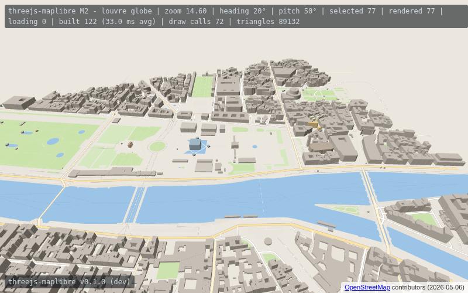
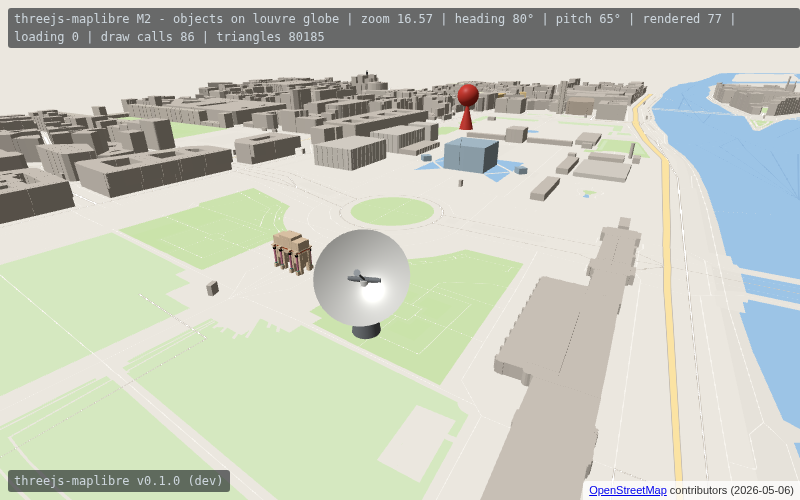

# threejs-maplibre

**A three.js map engine for OpenStreetMap data, with MapLibre interop.**

MapLibre GL JS is the leading open web map renderer, but it is a *map* engine: a
specialized 2.5D renderer. three.js is a *general* 3D engine: full scene graph,
physics-friendly, PBR lighting, post-processing, XR. This project connects the
two worlds so that OSM data and the MapLibre ecosystem become first-class
citizens inside three.js, and three.js scenes become first-class citizens on
MapLibre maps.

What none of the existing bridges (threebox, maplibre-three-plugin) provide:
a three.js-**native** map engine (tiles, vector styling, buildings, indoor)
rather than a thin overlay, plus the bridge in both directions.

## Live demo

[clement-igonet.github.io/threejs-maplibre](https://clement-igonet.github.io/threejs-maplibre/), deployed
from `main` by the Pages workflow: the M1 globe and planar raster demos, the M2
[vector demo](https://clement-igonet.github.io/threejs-maplibre/demo/vector.html)
(the Louvre from an OSM extract, or [any city](https://clement-igonet.github.io/threejs-maplibre/demo/vector.html?data=openfreemap)
from OpenFreeMap's Liberty style), [3D objects](https://clement-igonet.github.io/threejs-maplibre/demo/objects.html)
placed by latitude and longitude, and the [standalone page](https://clement-igonet.github.io/threejs-maplibre/demo/standalone.html)
that loads the built library from one `<script>` tag.




All demos share MapLibre-style controls: drag to pan, wheel or pinch to zoom,
right drag (ctrl/shift + drag on a trackpad) to turn and tilt, two fingers
sliding together to tilt. `?lat=&lon=&alt=&heading=&pitch=` opens a view, e.g.
[Paris, tilted](https://clement-igonet.github.io/threejs-maplibre/demo/globe.html?lat=48.8566&lon=2.3522&alt=1500&heading=30&pitch=60).

## Using the library

Two builds come out of `npm run build` (or `docker compose run --rm build`,
podman works the same), in `build/`:

- `threejs-maplibre.module.js`: an ES module that imports `three`, for
  bundlers and import maps, next to your own copy of three.js;
- `threejs-maplibre.js`: a standalone script carrying its own three.js, for
  a plain `<script>` tag with no build step; the API is the global
  `threejsMaplibre`, and `threejsMaplibre.THREE` is the bundled three.js.

Both embed the tile Worker, so a single file works from any origin or CDN.

With an import map (the same way three.js itself is used):

```html
<script type="importmap">
{ "imports": {
	"three": "https://cdn.jsdelivr.net/npm/three@0.180.0/build/three.module.js",
	"threejs-maplibre": "./build/threejs-maplibre.module.js"
} }
</script>
<script type="module">
import { HemisphereLight, PerspectiveCamera, Scene, WebGLRenderer } from 'three';
import { MapControls, Style, VectorTileMap, VectorTileSource } from 'threejs-maplibre';

const style = await Style.load( 'https://tiles.openfreemap.org/styles/liberty' );
const source = await VectorTileSource.loadTileJSON( style.sources.openmaptiles.url );
const map = new VectorTileMap( source, style, { mode: 'globe', sourceId: 'openmaptiles' } );
scene.add( map, new HemisphereLight( 0xffffff, 0x8a8478, 1.0 ) ); // extrusions are lit

const controls = new MapControls( camera, renderer.domElement, { mode: 'globe' } );
controls.setView( { lat: 48.8606, lon: 2.3376, distance: 800, heading: 20, pitch: 50 } );

renderer.setAnimationLoop( () => {
	controls.update();
	map.update( camera, renderer );
	renderer.render( scene, camera );
} );
</script>
```

With a `<script>` tag and nothing else, as in
[demo/standalone.html](demo/standalone.html):

```html
<script src="build/threejs-maplibre.js"></script>
<script>
const { THREE, MapControls, Style, VectorTileMap, VectorTileSource } = threejsMaplibre;
// same code as above, with THREE.Scene, THREE.PerspectiveCamera, ...
</script>
```

Any three.js object stands on the map through a `MapAnchor`, a Group placed
by latitude and longitude whose children live in a local frame in meters (x
east, y up, -z north), on the globe as on the plane:

```js
const antenna = new MapAnchor( { mode: 'globe' } ).setLocation( 48.8613, 2.3323, 0, 0 );
antenna.add( gltf.scene ); // a model in meters, y up, facing north
scene.add( map, antenna );
```

Everything in `src/` is also importable directly (`threejs-maplibre/src/index.js`)
for a bundler that prefers sources. The package is not on npm yet; install it
from a checkout or the built files until the first release (M6).

## Local workflow

Nothing but a container runtime is needed, `docker compose` or `podman compose`:

| Command | What it does |
|---|---|
| `compose run --rm build` | the library in `build/` |
| `compose up dev` | the demos from the sources on http://localhost:5173/demo/ |
| `compose up preview` | the built site, library and demos as deployed, on http://localhost:4173/ |
| `compose run --rm test` | unit tests (vitest) |
| `compose run --rm screenshot` | deterministic demo screenshots in `screenshots/` |
| `compose run --rm bench` | raster engine benchmark against 3d-tiles-renderer |
| `compose run --rm bench-vector` | vector engine benchmark against maplibre-gl-js |
| `compose run --rm budget` | the performance budget CI enforces (`bench/budget.json`) |

## Milestones

| Milestone | Tracking issue |
|---|---|
| [M1 Tile foundations](../../milestone/1): OSM XYZ tiles on a three.js globe and plane | [#1](../../issues/1) |
| [M2 Vector tiles and styling](../../milestone/2): MVT to three.js geometry, MapLibre style subset | [#2](../../issues/2) |
| [M3 MapLibre bridge](../../milestone/3): two-way maplibre-gl / three.js interop | [#3](../../issues/3) |
| [M4 Buildings and indoor](../../milestone/4): Simple 3D Buildings + Simple Indoor Tagging | [#4](../../issues/4) |
| [M5 Gamification showcase](../../milestone/5): character navigation on real OSM data | [#5](../../issues/5) |
| [M6 Documentation and adoption](../../milestone/6): docs, releases, upstream, corpus | [#6](../../issues/6) |

## Related work by the author

- [maplibre-gl-indoor](https://github.com/clement-igonet/maplibre-gl-indoor): indoor display and client-side navigation for MapLibre
- OpenEarthView (2016-2018): OSM tiles projected on a three.js globe; [three.js PR #12586](https://github.com/mrdoob/three.js/pull/12586)
- Upstream three.js example proposal for an OSM raster-tile globe (in preparation)

## Funding

A grant application to the [NLnet Foundation](https://nlnet.nl/) covers M1-M6.
This repository is the public tracking point: one milestone and one tracking
issue per work package.

## License

MIT (code to come).
