# Design notes

## M1 Tile foundations

### Why a native tile engine and not 3d-tiles-renderer's generated surface

[3d-tiles-renderer](https://github.com/NASA-AMMOS/3DTilesRendererJS)'s
`GeneratedSurfacePlugin` + `XYZTilesOverlay` (the former `XYZTilesPlugin`)
already put XYZ raster tiles on a globe, and this project reuses that library
where it fits (the three.js example submitted upstream in M1 is built on it).
The native engine exists because the goals diverge:

- **3D Tiles is the wrong intermediate model for a map engine.** The plugin
  adapts XYZ pyramids into a 3D Tiles tileset, inheriting its traversal,
  error semantics and content pipeline. Issues like
  [#1636](https://github.com/NASA-AMMOS/3DTilesRendererJS/issues/1636)
  (overlay splitting stalling on the geometric-error impedance mismatch)
  come exactly from that adaptation layer. That one is fixed upstream now,
  by [#1730](https://github.com/NASA-AMMOS/3DTilesRendererJS/pull/1730)
  (a texel-size floor on the split tiles' error, merged 2026-09-28), but the
  impedance is in the design and the next case will look like it. A raster
  map needs one thing:
  screen-space texel error over a quadtree, which is ~200 lines here
  (`RasterTileMap`) instead of a tileset emulation.
- **M2-M4 build on this tree.** Vector tiles, MapLibre styling, buildings and
  indoor need direct control of the tile tree (per-layer geometry builders,
  style-driven rebuilds, worker pipelines). A 3D Tiles facade would have to
  be unwound for each of those.
- **The MapLibre bridge needs MapLibre semantics.** Zoom levels, mercator
  tile addressing and style sources map one-to-one here, which keeps the M3
  two-way bridge honest.

What is deliberately reused instead of rebuilt: gkjohnson's globe controls
work (the upstream example uses `GlobeControls`), and the ellipsoid math
conventions (+Y pole, lat/lon frames) so scenes are interoperable between the
two libraries.

### How LOD works

`TileTree.update()` (shared by the raster and vector maps) runs two walks
per frame:

1. **Selection**: from the root tiles, a tile splits while one of its texels
   projects to more than `maxScreenTexel` pixels (1.4 for raster, 2 for
   vector, where there is no texel to blur and 2 matches the zoom MapLibre
   fetches a tile at), computed from the tile's latitude-corrected ground
   texel size and its bounding-box distance to the camera; capped at the
   source's `maxZoom`. Culling prunes whole subtrees.
2. **Replace refinement**: a selected tile draws once its content is loaded
   and fully faded in; until all children of an inner node cover their area,
   the nearest ready ancestor keeps drawing beneath them (`polygonOffset` and
   `renderOrder` resolve the coplanar overlap), so refinement never opens
   holes. Ancestors are requested for that only within `backfillLevels`
   (default 4) of the leaves: at street level the z0..z10 chain covers
   nothing visible and was a third of the requests.

Culling on a globe needs more than a box against frustum planes
(`TileBounds.js`). The frustum continues underground past the horizon, an
axis-aligned box around a large curved tile reaches deep into the planet and
meets it there, and a plane-only test accepts boxes that sit past a frustum
edge. So a tile gets an oriented box in its own east/north/up frame, grown
by `contentHeight` (default 1000 m) for buildings, the view is the frustum
cut at the horizon distance for that height, and the two are tested with all
separating axes (exact for convex shapes). A per-tile bounding cone against
the visible cap of the sphere rejects the far side of the planet before the
box test. Before this, a street-level view over Paris requested 5 to 20x the
tiles MapLibre did; after, the two engines request within a few tiles of
each other (see the vector benchmark under M2).

Decoded textures reach the GPU through a per-frame time budget
(`uploadBudgetMs`, default 2 ms, at least one upload per frame): the walk
queues the tiles it wants, `renderer.initTexture()` uploads them in order
after the walk, and a tile whose texture is not uploaded yet counts as not
ready, so its ancestor keeps drawing. A burst of arrivals (typical after a
fast zoom, when a whole level lands within a few frames) then costs a few
milliseconds per frame instead of one long frame. Textures for tiles that
leave the selection are parked in an LRU cache (dispose on evict); in-flight
fetches for deselected tiles are aborted.

### Measured against 3d-tiles-renderer

`npm run bench` (or `compose run --rm bench`) drives both engines through the
same four camera poses and a scripted city-to-street fly-in, over the same
offline stub tile source, in headless Chrome. Both engines fetch tiles through
`fetch()` + `createImageBitmap`, so "requests" counts the same thing for both.
Full output is in `bench/results.json`; the table below is from a run on
2026-09-21 with three.js 0.180 and 3d-tiles-renderer 0.5.3, SwiftShader on
2 CPUs of a shared VM (load average 5), 800x500 viewport. Absolute times are for that environment only; the
ratios are what matters.

| pose | metric | native (maxScreenTexel 1.4) | native (maxScreenTexel 1) | 3d-tiles-renderer (errorTarget 1) |
|---|---|---|---|---|
| earth, 20 000 km | requests / draw calls / triangles | 5 / 4 / 2 048 | 5 / 4 / 2 048 | 21 / 16 / 18 432 |
| | time to stable | 0.5 s | 0.5 s | 0.9 s |
| region, 400 km over Paris | requests / draw calls / triangles | 93 / 59 / 30 208 | 121 / 84 / 43 008 | 112 / 57 / 62 016 |
| | time to stable | 3.0 s | 3.9 s | 15.3 s |
| city, 8 km nadir | requests / draw calls / triangles | 43 / 58 / 29 696 | 46 / 74 / 37 888 | 52 / 55 / 59 840 |
| | time to stable | 4.1 s | 2.3 s | 10.0 s |
| street, 1.5 km tilted 60 degrees | requests / draw calls / triangles | 167 / 149 / 76 288 | 268 / 229 / 117 248 | 316 / 238 / 258 944 |
| | time to stable | 9.0 s | 12.9 s | 78.9 s |
| | JS heap | 15 MB | 20 MB | 75 MB |
| fly city to street, 240 frames | requests during fly and settle | 17 | 42 | 24 |
| | mean / p95 frame CPU | 8.7 / 7.1 ms | 4.9 / 7.4 ms | 6.1 / 9.5 ms |
| | settle after fly | 3.8 s | 5.1 s | 5.7 s |

Reading it:

- **Draw counts are comparable once converged** (street: 149 vs 238 draws,
  with the plugin's `errorTarget 1` sitting between the two native settings),
  and the plugin's per-frame CPU is as good as the native engine's. Rendering
  is not where the two differ.
- **The load path is.** On a direct jump to the street pose the plugin
  enqueues 449 tiles for parsing at once (every ancestor within the frustum
  out to the horizon; the generated surface has no download step, so the
  whole tree lands in the 5-wide parse queue and drains at a few tiles per
  second while each parse waits on its overlay texture), and it takes 80 s to
  settle where the native quadtree requests 167 tiles and settles in 6 s. The
  same difference shows at region scale (18 s vs 2.4 s). Arriving at the pose
  progressively (the fly-in) hides it, which is why it is easy to miss in an
  interactive demo.
- **Triangles**: the plugin's surface meshes are denser (30x15 vertex
  minimum per tile) than the 16x16 patches here, hence 2 to 3x the triangles
  for a similar draw count.
- **Memory**: the native engine's heap stays 3 to 4x smaller at street level.
- **Frame spikes**: the max frame is not a usable number in this
  environment. Logging every fly-in frame over 16 ms showed most of them with
  nothing happening in the engine (no new mesh, no upload, no request; up to
  540 ms on a frame that only redrew 58 tiles), which is the software
  rasterizer and the shared host, so the table reports the p95 instead. The
  engine-side burst that was visible before (six textures uploaded in one
  frame at 318 ms) is gone: uploads are budgeted per frame, and one 256x256
  upload with mipmaps costs ~100 ms under SwiftShader, well under a
  millisecond on a GPU.

### Precision

Tile meshes anchor their vertices relative to the tile center
(`TilePatchGeometry`), so Float32 vertex precision holds at street-level
zoom; the center itself lives in the mesh transform (Float64 in JS until it
reaches the GPU as a matrix). Patch grids are uniform in Web Mercator space,
so the (Mercator) tile texture maps linearly with no reprojection artifacts.

### Controls

Stock `OrbitControls` around the globe center do not make a map: their rotate
and zoom speeds are an orbit angle and a distance-to-center factor, constant
from 20 000 km down to street level (a 100 px drag moved the ground by
~100 km at 2 km altitude), a horizontal drag rotates about the pole, and the
camera always looks at the center, so there is no tilt. `MapControls` keeps
MapLibre's camera state instead: a ground point at the screen center
(lat, lon), the distance from it to the camera, a heading and a pitch. The
camera is placed from that state each frame, and the gestures edit the state
in ground units:

- one pointer drag pans by `2 * distance * tan(fov / 2) / clientHeight` meters
  per pixel (divided by `cos(pitch)` along the screen's vertical axis);
- wheel and trackpad zoom is MapLibre's `ScrollZoomHandler` ported: the
  device is told apart by the deltas (multiples of 4.000244140625 are a
  macOS mouse, values under 4 a trackpad, a pinch arrives as a trackpad
  with ctrlKey) and by their timing (a lone event is a wheel, a run of
  them a trackpad); a frame's deltas scale the map by
  `2 / ( 1 + e^( -|delta| * rate ) )`, two at most, at 1/450 for a wheel and
  1/100 for a trackpad; the target is approached over 200 ms; the ground
  under the cursor stays in place; a touch pinch zooms around the fingers'
  midpoint while their motion pans and their twist turns;
- keys as MapLibre's `KeyboardHandler`: + and - a level (two with shift),
  with cmd or ctrl as well, since the map is the page; arrows pan 100 px,
  with shift they turn 15 and tilt 10 degrees;
- two fingers sliding vertically together at a steady spread tilt the view
  (0.5 degree per pixel); on desktop, a right drag (or ctrl/shift + drag)
  turns (0.25 degree per pixel) and tilts;
- pitch is clamped to [0, 85] degrees, latitude to +/-85 (the Web Mercator
  edge), and the distance so the camera stays above `minAltitude`;
- `mode: 'planar'` places the same state on the Web Mercator plane, in
  mercator meters like the scene, so both demos share one set of gestures.

Pointer events arrive one finger at a time, so the two-finger intent is
decided once both fingers have moved 8 px (or one finger 30 px with the other
still, which is a pinch with an anchor). `npm run controls-check` drives all
of this in headless Chrome with real multi-touch emulation: x0.950 per notch,
439 m moved for 439 m of pixels on a 100 px drag at 1.9 km, a 1.2x pinch
combined with a 100 px two-finger drag lowers the distance x0.850 and moves
the ground by 337 m for 373 m of pixels at the new scale, a 100 px two-finger
slide tilts by 46 degrees without zooming, a 100 px right drag turns by
25 degrees, and the camera altitude matches `distance * cos(pitch)`; the same
run passes on the planar demo.
No inertia yet; MapLibre-style fling and easing are M3 work with the camera
bridge, together with the exact pan (raycast the pointer onto the ellipsoid
rather than scale by the center's meters per pixel).

### Known limits (accepted for M1)

- Perspective cameras only (SSE uses `camera.fov`).
- Frustum culling only; no horizon culling yet, so the far side of the globe
  costs traversal (not draws) at low altitude.
- Web Mercator polar caps (above ~85.05 degrees) are not filled.
- One raster source per `RasterTileMap`; overlay compositing is out of scope
  until M2.

## M2 Vector tiles

### Vector tile decoding

`VectorTileLoader` fetches the `.pbf` on the main thread (abortable, same as
the raster loader) and hands the buffer to a small pool of Workers that decode
it with `@mapbox/vector-tile`. The worker answers with flat arrays per source
layer (`decodeVectorTile`): feature types, ids and properties, plus a single
`Int32Array` of tile coordinates indexed through `featureStart` and
`ringStart`. That is the layout the geometry builders read, and it transfers
between threads without copying. Without Workers (Node, tests) the same
function runs inline. Polygon rings keep their MVT winding; classifying
exterior rings and holes belongs to the polygon builder.

`npm run decode-check` decodes the stub city's tiles in headless Chrome
through real Workers and inline. The stub tiles are small (under 1 kB each,
the city is 2.4 km of grid), so they time the pipeline, not the parser: 0.6
to 1.4 ms per tile inline, 1.7 to 3.5 ms per tile through the Workers once
they are warm (the first Worker start under the dev server costs ~600 ms of
module loading). A real OpenMapTiles tile is another order: the z14 tile over
central Paris from OpenFreeMap is 1.07 MB, 13 layers, 16 952 features,
96 027 vertices, and decodes in 93 ms cold, 25 to 35 ms warm in Node 20 on the
shared VM; z12 (338 kB) and z10 (268 kB) take 10 to 12 ms. This is what the
Workers are for: at street zoom a screen shows a handful of such tiles, and
the geometry build that follows (M2 PR B) costs more than the decode.

### Style evaluation

`Style` compiles a MapLibre style with `@maplibre/maplibre-gl-style-spec`
(the first runtime dependency besides three.js: `featureFilter`,
`normalizePropertyExpression` and the v8 spec for defaults, 76 kB minified
with the engine's own code, 23 kB gzipped). The honoured layer types and
properties are listed in `style-subset.md`; anything else stays on the layer
and is reported once per layer in `style.warnings`. Each property's
`kind` (constant, camera, source, composite) tells the builders whether a
value is a material constant, a per-frame uniform or baked per vertex, which
is the same split MapLibre makes between paint uniforms and data-driven
attributes.

### Geometry and rendering

The Worker that decodes a tile also builds its geometry (`buildTile`): one
block per style layer with something to draw, as flat attribute arrays that
transfer to the main thread and become `BufferAttribute`s there within the
per-frame budget the raster map already uses for texture uploads. Every layer
is built for every tile carrying its data, evaluated at the tile's zoom
clamped into the layer's zoom range; whether a block is drawn is decided per
frame from the map zoom (MapLibre's convention, a 512 px tile at integer
zoom, derived from the ground distance under the view center). One view
mixes tiles of several zooms, so a layer can not be tied to the tile zoom
the way MapLibre does it: a far z13 tile must still carry the extrusions a
minzoom 14 layer shows once the map is past 14.

What the style evaluates from the feature (`source` and `composite` kinds) is
baked per vertex; what it evaluates from zoom alone (`camera` kind) or from
nothing is a per-frame uniform, with the baked value set to 1 so the shader
computes `baked * uniform`. A zoom-dependent line width is a uniform update,
not a rebuild. A composite value is frozen at the tile's zoom, the one
known limitation of the scheme.

Tile coordinates are projected relative to the tile center (`TileProjection`)
so Float32 attributes keep street-level precision on the globe, where ECEF
coordinates are millions of meters; the tile object carries the offset. Both
modes expose the same `project` and `up` functions, so the builders never
branch on the mode.

Polygons are clipped to the tile square, grouped into exterior plus holes by
their MVT winding and triangulated with three.js's own Earcut (`fill`), or
extruded along the local up vector (`fill-extrusion`, lit by a
`MeshLambertMaterial` with `flatShading`, which takes the normal of a face
from the derivatives of the view position, so no normal is built,
transferred or kept: 12 bytes a vertex on the heaviest block type). Lines
are triangle strips extruded in the vertex shader by a screen-space half
width (`VectorLineMaterial`): each
vertex carries its tangent direction and side, the width in pixels is
converted to local units at the vertex's depth, edges are antialiased in the
fragment shader and lines thinner than a pixel are drawn one pixel wide and
faded, as MapLibre does. Joins are miter up to `line-miter-limit`, then
bevel; caps are butt. A run cut by the tile edge is extruded along that edge
so the neighbour's half meets it without a notch. `line-gap-width` builds two
strips, `line-offset` shifts them, `fill-outline-color` adds a line block to
a fill layer. A line vertex is the one this engine builds most of, so its
attributes are quantized (`build/quantize.js`): the extrude direction and
the baked width, gap and offset as normalized Int16 against a fixed scale,
the side and gap flags as Int8, which takes a line vertex from 48 bytes to
30 with no visible difference (the sub-pixel shift on an antialiased edge is
the only thing a screenshot diff shows).

Draw order follows the style: meshes render in layer order, extrusions
opaque with depth, fills and lines without depth writes so coplanar layers
stack instead of fighting. Fills and lines drawn with an image pattern
(`fill-pattern`, `line-pattern`) are skipped rather than painted in the
default black; Liberty's `road_area_pattern` is the visible case.

Draw calls do not follow tiles. Each style layer owns one `BatchedMesh`:
uploading a tile copies its blocks into the batch of their layer, drawing it
adds one instance placed at the tile center, so a layer costs one draw call
however many tiles are on screen. The Louvre view is 9 draw calls whether it
holds 9 tiles or 39, and Liberty's hundred layers are about 50, one per
layer with something in view, against MapLibre's 218 at the same pose.

Instance matrices are float32, so a batch cannot sit at the origin of the
globe: ECEF coordinates are millions of meters and float32 would leave half
a meter of precision. The batches sit at a floating origin that follows the
camera and each instance holds its tile center minus that origin; when the
camera drifts more than `originRadius` (10 km) away the origin moves with it
and the instance matrices are rewritten, a few dozen at a time. A batch
starts at twice the first tile it holds and grows by half when a tile does
not fit, repacking what deleted tiles left behind first; when a tile leaves
and half the batch is idle it repacks and gives the buffers back, so a view
that flies out of a dense city does not keep its batches.
`stats.batchBytes` and `stats.geometryBytes` report what the batches reserve
against what the tiles in them occupy. What a view costs is in the
benchmark below.

### Measured against maplibre-gl-js

`npm run bench:vector` (or `compose run --rm bench-vector`, env `BENCH_DATA`
louvre or openfreemap, `BENCH_MODE` globe or planar) loads the same style
and the same tiles in this engine and in maplibre-gl-js 6.11.2, in headless
Chrome, and drives both through three poses (district z13 nadir, louvre
z14.6 pitched 50 degrees, street z16.5 pitched 62 degrees) and a 240-frame
fly from district to street. Draw calls and triangles are counted the same
way for both, by wrapping the `WebGL2RenderingContext` draw functions and
the `WEBGL_multi_draw` extension a `BatchedMesh` draws through (one call,
its ranges summed into the triangle count); tile requests are counted at
each engine's tile URL hook (MapLibre fetches from a worker, so a `bench://`
protocol handler stands in for its network). Heap is read after a forced
collection, so both engines are measured on what they hold rather than on
what the collector has not got to yet. Zoom is converted to camera distance
with MapLibre's field of view so the two views cover the same ground. Full
output is in `bench/vector-results-*.json`; the tables are from runs on
2026-09-27, SwiftShader on 2 CPUs of a shared VM, 800x500 viewport. Timings
there vary by +-30 % between runs, so read the ratios, not the
milliseconds.

Louvre extract (own Overpass export, z13 to z15), globe:

| pose | metric | threejs-maplibre | maplibre-gl-js |
|---|---|---|---|
| district | tiles requested / draw calls / triangles | 9 / 9 / 62 490 | 10 / 60 / 25 990 |
| | time to stable / heap | 4.0 s / 103 MB | 3.3 s / 56 MB |
| louvre | tiles requested / draw calls / triangles | 17 / 9 / 91 922 | 0 / 68 / 76 827 |
| | time to stable / heap | 6.9 s / 160 MB | 3.1 s / 52 MB |
| street | tiles requested / draw calls / triangles | 6 / 9 / 44 878 | 7 / 143 / 53 275 |
| | time to stable / heap | 3.3 s / 104 MB | 2.6 s / 59 MB |
| fly district to street | tiles requested | 8 | 15 |
| | mean / p95 / max frame | 133 / 302 / 505 ms | 153 / 314 / 585 ms |
| | settle after fly / draw calls / heap | 1.5 s / 9 / 104 MB | 2.4 s / 143 / 67 MB |

Same data, planar:

| pose | metric | threejs-maplibre | maplibre-gl-js |
|---|---|---|---|
| district | tiles requested / draw calls / triangles | 6 / 9 / 48 674 | 10 / 60 / 25 990 |
| | time to stable / heap | 3.4 s / 64 MB | 2.9 s / 52 MB |
| louvre | tiles requested / draw calls / triangles | 17 / 9 / 88 388 | 0 / 68 / 76 827 |
| | time to stable / heap | 5.7 s / 84 MB | 2.3 s / 52 MB |
| street | tiles requested / draw calls / triangles | 7 / 9 / 44 757 | 7 / 143 / 53 275 |
| | time to stable / heap | 2.5 s / 122 MB | 3.4 s / 58 MB |
| fly district to street | tiles requested | 3 | 15 |
| | mean / p95 / max frame | 123 / 242 / 625 ms | 141 / 260 / 494 ms |
| | settle after fly / draw calls / heap | 1.6 s / 9 / 102 MB | 2.6 s / 143 / 68 MB |

OpenFreeMap's Liberty style, live planet tiles (z14 max, 1 MB and 17 k
features per tile over Paris), about a hundred layers, globe:

| pose | metric | threejs-maplibre | maplibre-gl-js |
|---|---|---|---|
| district | tiles requested / draw calls / triangles | 9 / 52 / 352 633 | 10 / 187 / 204 532 |
| | time to stable / heap | 14.6 s / 81 MB | 9.2 s / 30 MB |
| louvre | tiles requested / draw calls / triangles | 6 / 55 / 822 587 | 0 / 311 / 1 519 628 |
| | time to stable / heap | 22.0 s / 128 MB | 18.7 s / 28 MB |
| street | tiles requested / draw calls / triangles | 0 / 48 / 519 817 | 7 / 345 / 714 167 |
| | time to stable / heap | 7.9 s / 128 MB | 16.0 s / 30 MB |
| fly district to street | tiles requested | 1 | 15 |
| | mean / p95 / max frame | 426 / 807 / 1136 ms | 431 / 973 / 1460 ms |
| | settle after fly / draw calls / heap | 7.7 s / 48 / 137 MB | 6.3 s / 345 / 36 MB |

Reading it:

- **Tile requests are on par.** MapLibre's 0 at the louvre pose is a cache
  effect: it fetched the tiles it needs there at the district pose (it loads
  the integer zoom, this engine picks z13 there and z14 later). Getting
  there took three changes to the shared quadtree (horizon cone, oriented
  boxes against a horizon-cut view volume, `backfillLevels`, see M1); before
  them the engine requested 49 / 58 / 79 tiles at the three Louvre poses.
- **Draw calls are one per layer, not per tile.** The Louvre style is 9
  draws at every pose, against MapLibre's 60 to 143; Liberty is 48 to 55
  against 187 to 345. Two things get there. MapLibre draws every antialiased
  fill layer twice per tile (the fill, then its outline as `GL_LINES`), the
  background once per tile, and two stencil mask passes per tile each time
  the source changes, where here a fill is one draw and an outline exists
  only when the style gives it a color; that alone had this engine at half
  MapLibre's count with a mesh per tile per layer (32 / 71 / 56 on the
  Louvre globe, 144 / 162 / 117 on Liberty, measured on the same machine
  before this change). MapLibre 6 draws more than 5 did at the steep poses
  (143 against 110 at street on the Louvre extract, 345 against 218 on
  Liberty), since it keeps more tiles in view there. Batching the tiles of a layer into one `BatchedMesh`
  took the rest: what is left is one draw per style layer with something in
  view, and it no longer grows as the view widens.
- **Triangles are 1.7 to 2.4x MapLibre's at district**, which is not the
  meshes: `fill-outline-color` is tessellated into a line strip here (two
  triangles per segment, so an outline costs about as much as the fill it
  wraps), where MapLibre draws outlines with `GL_LINES`. Drawing outlines as
  `LineSegments` is the cheap fix and would bring district under MapLibre's
  count. At street level on the Louvre extract, where outlines are a small
  share, this engine already draws fewer triangles (44 k vs 53 k). On
  Liberty over the globe MapLibre draws about twice the triangles at the
  louvre and street poses; part of that is its globe subdivision (fills and
  lines are cut to follow the curvature), part is that it served those poses
  from the tiles it had, so the two are not like for like there.
- **Time to stable is 1.2 to 2.5x MapLibre's on a direct jump on the Louvre
  extract**, and it is worker time: `stats.buildMs` puts one Louvre tile at
  100 to 200 ms to decode, style and triangulate on this VM, and the
  poses wait on 6 to 17 of them through 2 CPUs. Where the build spends it is
  not profiled yet (the expressions are MapLibre's own compiled ones, so the
  suspects are the clipping and Earcut per feature and the per-layer block
  assembly); a per-stage timing in the worker is the next measurement.
  Uploading now copies a tile into its layers' batches instead of wrapping
  its arrays, which the upload budget meters like any other upload; it did
  not move time to stable out of the run-to-run spread, but it is the first
  place to look if it does. On Liberty, where a tile is 1 MB and the network
  is in the loop, this engine is slower to the district (14.6 s against
  9.2 s) and louvre poses (22.0 against 18.7) and twice as fast at street
  (7.9 against 16.0), while MapLibre settles faster after the fly (6.3 s
  against 7.7 s).
- **Memory is the cost of this design.** The main-thread heap is 1.8 to
  3x MapLibre's on the Louvre extract and 4x on Liberty (128 vs 30 MB at
  street); neither number includes the workers, where MapLibre keeps its
  decoded tiles. `stats.batchBytes` and `stats.geometryBytes` say where it
  goes: at the Louvre street pose the batches reserve 36 MB and the tiles in
  them occupy 29 MB, on Liberty 118 and 96 MB. Both came down from the first
  batched version: a built z14 Liberty tile went from 15.6 to 10.8 MB by
  dropping the normals (`flatShading` takes them from the winding) and
  quantizing the line attributes, which took what a Liberty view holds from
  104 to 84 MB, and a batch now gives its buffers back when the tiles that
  filled it leave. What is left is the geometry itself, held on the CPU side
  as well as on the GPU because `BufferAttribute` keeps its array, plus the
  slack of growing by half. Next, in order: `LineSegments` for
  `fill-outline-color` instead of a
  tessellated strip (3.8 of those 10.8 MB, and the triangle
  count below), and quantized positions, which need the tile scale folded
  into the instance matrix.
- **Frame times** are the software rasterizer's, as in the raster benchmark,
  and they do not separate the two engines. Across the runs behind these
  tables the mean frame on the fly went from 0.65x to 1.2x MapLibre's and
  the ordering flipped between runs of the same build, on a machine whose
  load changed under us. Ranking them needs a quiet machine and a real GPU;
  what this benchmark can say is that the work per frame is in the same
  range.

### The budget CI enforces

`npm run budget` (or `compose run --rm budget`) drives the same three poses
and fly on the committed Louvre extract, this engine only, and fails when a
number is over its ceiling in `bench/budget.json`. It runs on every pull
request.

What it enforces is what a machine without a GPU can answer for: the tiles a
view asks for, the draw calls and the triangles it hands the GPU, and the
engine's own CPU per frame once the view is still and every tile has landed.
That last one is the 60 fps target, stated the only way CI can state it: at
16.7 ms a frame the engine has to leave the frame to the GPU, and it takes
1.1 ms on the fly today, so it does. The counts are exact numbers with a
little headroom (a slower machine can take an extra frame to settle and ask
for one more ancestor on the way); the draw calls are the tight one, since a
layer is one call and a regression there is what this guards.

Two things are printed and not enforced. Frame times, because a software
rasterizer's are not the target machine's. And the engine's CPU while tiles
are landing, which is 3 to 30 ms at the p95 of a pose and moves by a factor
of three between runs of the same build: one frame in twenty carries a tile
upload (4 to 5 ms of copying into the batches, measured in Node) or the
collector, and a ceiling over that would either be too loose to mean
anything or too tight to stay green. Smoothing that burst is real work,
listed with the rest under the benchmark above.

`BUDGET_UPDATE=1` records the run as the new ceilings, for a change that is
meant to move a number.

### How far the map goes

The camera here is free: street level, inside a building, a tunnel, a
cockpit, a satellite. Tilt it towards the horizon and the quadtree does what
it is asked, which is to cover the view, and the view reaches the edge of the
world. That is right for a map and wrong for a walk down a street, where
everything past the next junction is a few pixels of grey that still cost a
request, a build and a draw.

`viewDistance` (meters, `TileTree`, `Infinity` by default) cuts the
selection walk: a tile whose content box is further than that from the
camera is culled, so it is never requested, never built and never drawn. The
distance is to the box, which stands `contentHeight` above the surface, so
the tile under a camera is always in range however high it flies.

Cutting leaves an edge, so `createFog( style, { viewDistance } )` returns a
`three.Fog` that fades the last 40 % of the range into the colour the style
says the horizon has. MapLibre keeps the sky as a root property of the style
document rather than a layer, so `sky.fog-color` is the value it blends the
ground into, with `sky.horizon-color` and then the background layer as
fallbacks. `VectorLineMaterial` gained the fog chunks, since a
`ShaderMaterial` gets none of what the built-in materials get for free.

Measured on Liberty over Paris, tilted 67 degrees at 700 m, 1200x800:

| | tiles built | tiles drawn | draw calls | triangles |
|---|---|---|---|---|
| no view distance | 13 | 6 | 55 | 919 300 |
| `viewDistance` 2 km | 9 | 3 | 49 | 453 130 |
| `viewDistance` 500 m | 5 | 1 | 39 | 155 082 |
| street level, pitch 85, 300 m | 5 | 1 | 39 | 155 082 |

And the case that says whether the default is right: a camera 36 000 km up,
where the whole disc is in frame, still selects 4 tiles and draws 4 calls
with 20 319 triangles, because the horizon at that altitude is 40 000 km
away and the default cuts nothing. One number covers a room and a
geostationary orbit.

### What the map may hold

A free camera can be tilted at the horizon, and a tilt towards the horizon
over a city asks for everything out to it. Measured on Liberty over Paris at
300 m, 1200x800, pitch swept 60 to 89.5 and back in one session, the way a
user tilts: the tiles in view went from 2 to 54, but the page went from 91
MB to 510 MB and kept climbing. Three things were wrong, and the sweep
found each one in turn.

- **Retention was counted in frames.** A tile that left the view kept its
  object and content for 60 frames, which is a second at 60 fps and minutes
  on a software renderer at 0.2 fps: the frame is slow exactly when the
  view is heavy, which is when memory matters. The whole sweep advanced 86
  frames, so nothing was ever let go. Retention is `retainMs` now, 1000 by
  default.
- **The cache was a count.** 512 entries of parked content, and a Liberty
  z14 tile is 10 MB built where a tile of sea is nothing. `cacheBytes`
  (96 MB) bounds it, with `_contentBytes` saying what a tile weighs: the
  block arrays for a vector tile, the RGBA pixels for a raster one.
- **Nothing bounded what a frame could ask for.** One tilt issued 84 loads
  in a single frame, and every one of them landed and stayed. `memoryBudget`
  (192 MB) is the bound on resident content, in view and parked: past it the
  walk starts no new load and the coarser ancestor draws. Two details make
  it hold rather than leak. Loads in flight count against it at what a
  tile has weighed so far, since a budget that only sees landed tiles sees
  none of a burst, and a tile that lands is counted at once rather than at
  the next sweep. And parked content goes first: the cache is evicted to
  make room before a tile in view is refused, since what is parked is the
  least valuable thing held. `maxLoading` (16) caps the loads in flight on
  top, so a burst is sixteen tiles wide however many a frame wants.

The same sweep after:

| pitch | before: heap | after: resident | after: heap | refused | parked evicted |
|---|---|---|---|---|---|
| 60 | 131 MB | 41 MB | 123 MB | 0 | 0 |
| 80 | 362 MB | 209 MB | 253 MB | 11 | 0 |
| 89.5 | 425 MB | 195 MB | 261 MB | 20 | 8 |
| back to 60 | 476 MB | 219 MB | 285 MB | 0 | 27 |
| 89.5 again | 510 MB | 192 MB | 277 MB | 41 | 62 |

Resident holds at the budget through the swing, and the heap above it is
the engine itself plus the batches' own slack. The numbers a reader sees are
in the demo HUD (`resident`) and in `stats.residentBytes`, `stats.refused`;
the demo takes `?memoryMB= ?cacheMB= ?retainMs= ?maxLoading=` to try
others. A phone wants a smaller budget than a desktop, and a scene that
must never show a coarse tile wants a larger one; neither is a reason for
the default to be unbounded.

What a refusal looks like on screen is a coarser tile where a finer one
would have been, which is what the engine does while a tile loads anyway.
Not done here: choosing which tile to refuse. The walk is spatial, not
nearest first, so under pressure the budget goes to whichever tiles the
walk reaches first rather than to the ones in front of the camera.

### Labels and symbols

Symbol layers are parsed and kept but not drawn yet (`style-subset.md`).
What they ask for, measured on the z14 OpenFreeMap tile over the Louvre
(1.1 MB, the densest kind this engine sees) with Liberty's 25 symbol
layers: at street zoom 2 431 symbols in 12 layers, 30 859 glyphs from 92
distinct characters, 1 707 of them with an icon and 1 461 placed along a
line rather than at a point; at district zoom 392 symbols and 7 156 glyphs,
since the POI layers only switch on past z15. A street view holds several
such tiles, so a label engine here has to consider a few thousand candidates
per frame and draw a few hundred quads.

The plan, and what makes it different from drawing a fill:

- **Glyphs come from the style's `glyphs` URL**, the SDF ranges MapLibre
  serves (256 code points per PBF, one 8-bit signed distance bitmap per
  glyph). A style already points at a glyph server, and the format covers
  the scripts a map needs; rendering text with canvas measurements instead
  would tie the map to the browser's fonts. The ranges a tile needs are
  fetched once per font stack, decoded in a Worker and packed into an atlas
  texture. Paris Latin text is 92 distinct characters, so one 256x256 page
  at 24 px covers a European view; the atlas grows by pages.
- **Anchors are built in the Worker, placement runs per frame.** A point
  label's anchor and its glyph quads are tile data and belong with the rest
  of the block. A line label's glyphs follow the line as it turns on screen,
  so their angles depend on the camera and have to be recomputed on the main
  thread, as MapLibre does; the Worker's share is the line, the anchors
  along it and the shaping.
- **Collision is a screen-space pass over a uniform grid**, labels taken in
  layer order then `symbol-sort-key`, each box tested against the boxes
  already placed in the cells it spans. The prototype behind these numbers
  (the same real anchors, 800x500, 32 px cells) places 970 candidates in
  0.09 ms and 7 760 in 0.26 ms, so the pass fits in a frame with room to
  spare; the cost that matters will be the per-frame line placement, not the
  collision.
- **Drawing is one `BatchedMesh` per symbol layer**, like every other layer:
  a quad per glyph, the anchor in world space and the glyph offset applied
  in screen space in the vertex shader, the way `VectorLineMaterial` already
  turns a pixel width into local units. Labels then share the depth buffer
  with the buildings instead of floating over them in a DOM overlay, which
  is the point of doing this in three.js: a label can be occluded by a
  building, or stood up in 3D, and it still costs one draw call per layer.
- **Fading and cross-tile identity**: a label that wins or loses a collision
  fades over 300 ms rather than blinking, and a label keeps its identity
  across a zoom change through its feature id, so the same name does not
  flicker when the tile under it is replaced.

Deferred until the above works: `text-variable-anchor`, `icon-text-fit`,
vertical writing for CJK, the RTL shaping plugin, and curved labels beyond
one angle per glyph.

The strategy is settled here; the engine is built after M3. The bridge
decides something this design depends on: with maplibre-gl and three.js
sharing a camera, a map can keep MapLibre's own symbol layers drawn over
the scene, and that is worth knowing before writing a second label engine.
Either way the work above is the same shape, so nothing here is wasted, and
a style's labels are the last thing missing from a view that already has
its roads, water and buildings.

### Objects on the map

`MapAnchor` is a `Group` placed by latitude, longitude and height whose
children live in a local frame in meters, x east, y up, -z north, on the
globe as on the plane, so a three.js object built the usual way (y up, facing
-z) stands level and faces north wherever it is put; a heading turns it
clockwise from north. The objects demo places a 34 m dish antenna and a
marker pin over the Louvre this way, with `?model=` loading a glTF instead,
as MapLibre's "Add a 3D model" example does through a custom layer. Here the
object is an ordinary scene member: it shares the depth buffer with the
buildings, takes the scene's lights and shadows, and can be picked or
animated like anything else in three.js.

### Distribution

`npm run build` produces two files with Vite in library mode: an ES module
that keeps `three` as an import, for bundlers and import maps, and a
standalone UMD script that bundles three.js under the global
`threejsMaplibre` (`threejsMaplibre.THREE` exposes it), for a page with no
build step. The tile Worker is inlined in both as a Blob URL, so one file
works from any origin or CDN; the sources swap the Worker factory only in
the library build (a Vite alias on `createWorker.js`). Earcut is bundled from
`three/src/extras/Earcut.js` even in the module build, since import maps
only know the bare `three` specifier. The package's `exports` point at the
module build and keep `./src/*` open for a bundler that prefers sources.

## M3 MapLibre bridge

### A three.js scene inside a maplibre-gl map

`MapLibreLayer` is a maplibre-gl custom layer (`renderingMode: '3d'`, so
it shares the map's depth buffer) that draws a three.js scene with the
map's own camera. The scene lives in meters around an anchor, in the frame
`MapAnchor` gives its children (x east, y up, -z north), so an object built
the usual way stands level and faces north, and `layer.place( object, lng,
lat, altitude, heading )` puts it somewhere else on the map.

The whole bridge is one matrix product, done on the CPU in float64. Every
frame MapLibre hands the layer its projection as 64-bit matrices
(`CustomLayerProjectionData`, new in maplibre-gl 6, added for exactly this
reason: so a layer can transform before rounding to float32). The layer
multiplies the one that applies by the matrix from the anchor's frame into
MapLibre's space and gives three.js the product as the camera's projection.
The anchor's world coordinates never reach the GPU, only offsets of a few
hundred meters do, which is what keeps a building-scale scene still at
street level.

MapLibre has three spaces, not one, and `MapLibreFrames.js` builds the
matrix into each:

- mercator, 0..1 across the world, y southwards, z up in the same units
  (a meter is the same length in every direction, what MapLibre calls
  conformal); `mercatorFrame( lng, lat, altitude )`;
- the globe, a unit sphere with a point at `(sin lng cos lat, sin lat, cos
  lng cos lat)` (`globe_utils.ts`) and altitude along the radius;
  `globeFrame( lng, lat, altitude )`;
- the morph between them from zoom 11 to 12, where MapLibre's shader mixes
  the two clip-space results per vertex (`projectionTransition` going from 1
  to 0). A three.js camera holds one matrix, so the layer mixes the two
  matrices, which is the same thing at the anchor and drifts with the square
  of the distance from it, like the meters frame itself.

Both spaces are MapLibre's sphere, 6 371 008.8 m in radius, not the WGS84
ellipsoid this engine's own globe uses. On MapLibre's map, MapLibre's earth
is the one to stand on, and `MAPLIBRE_EARTH_RADIUS` is where that number
lives.

The frames are unit-tested against maplibre-gl's own `MercatorCoordinate`
and its sphere formula, and the whole path is measured against the map
(`npm run bridge-check`): for zooms 2 to 19, pitched and turned, points a
third of the view away from the anchor land within 0.08 px of where
`map.project()` puts the same ground, in both projections and through the
morph. A three.js box and a MapLibre `fill-extrusion` of the same size,
drawn one at a time and compared by the pixels they cover, overlap at 0.999
at every zoom where the map is flat.

On the pure globe that same box test first came out at 0.81, with MapLibre's
own square drawn up to 300 m north of `map.project()` at mid-latitudes,
which looked like a bug in maplibre-gl's globe path. It was not: the same
page on a real GPU (Apple, Safari) gives 0 at every latitude and zoom. The
offset is SwiftShader's, the software renderer the VM's headless Chrome uses,
so a sub-pixel discrepancy seen only there is not evidence of anything until
a real GPU has drawn it.

Evidence: the antenna and the pin from the objects demo, drawn inside a
MapLibre map on OpenFreeMap's Liberty style, on its globe and on its flat
map, standing where this engine's own map puts them, and occluded by
MapLibre's buildings because the depth buffer is one.

### Terrain, and two spaces

With terrain on the map, the anchor stands on it. Its elevation is asked of
the map every frame (`map.queryTerrainElevation`, exaggeration included,
which is what MapLibre's own three.js-on-terrain example does), so the
scene settles as DEM tiles land, and an object placed through
`layer.place()` is settled every frame on its own ground rather than the
anchor's: a pole 2 m above a hillside 240 m higher than the anchor stands
242 m up. The port of that example, `demo/bridge-terrain.html`, puts two
antennas on a Tyrolean hillside over Mapterhorn's keyless terrarium DEM;
the HUD reads the ground under each.

The layer has two spaces. `local`, the default, is meters around the
anchor, for anything building-sized, where float32 has to hold a
centimetre. `world` is MapLibre's own units, mercator 0..1 on the flat map
and the unit sphere on the globe, for content the size of a continent,
where a meters frame would drift (it is mercator linearised at one point)
and a kilometre of float32 precision is plenty. `worldPosition( lng, lat,
altitude )` gives a place in the space of the current frame and `onGlobe`
says which; content that must survive the morph rebuilds itself when that
flips, which is what MapLibre's own shaders do per vertex. Two of
MapLibre's examples are ported that way in `demo/bridge-world.html`: the
sine wave of "Animate a line", a point per frame across the world, and the
red triangle of "Add a custom style layer" over Helsinki, Berlin and Kyiv,
its raw WebGL replaced by a `Mesh`. Both are drawn without a depth test,
as MapLibre draws its 2D layers: at altitude 0 a line fights the globe's
own surface for the depth buffer and loses.

### Direction B: the map under the scene

The mirror of the layer: a maplibre-gl map in its own element beneath a
transparent three.js canvas, this engine's `MapControls` owning the input,
and every frame the map's camera derived from the scene's
(`MapLibreUnderlay.sync( camera )`). MapLibre's whole style shows through
under the 3D, labels and icons included, which is everything this engine
does not draw yet.

Flat, it is exact by construction. The scene is this library's planar
frame, Web Mercator meters with x east, y up and -z north; MapLibre's flat
map is the same projection. The underlay reads the camera, not the
controls: the ground point under the screen centre is the map's centre,
the distance to it against the vertical field of view gives the zoom
(`cameraToCenterDistance` is `0.5 * height / tan( fov / 2 )` pixels in
`transform`), the view direction gives bearing and pitch, the camera's
right against the level right gives roll, and `fov` is passed through with
`setVerticalFieldOfView`. `jumpTo` takes all of it. Measured (`npm run
underlay-check`), ground points a third of the view out land 0.000 px from
where `map.project()` puts them, straight down, at pitch 85 and turned,
from zoom 1.5 to 18. A free camera works as long as its view ray still
meets the ground; looking at the sky, `sync()` returns false and the map
stays where it was.

What a DOM underlay cannot do is share a depth buffer. The scene is always
over the map, so a building drawn here hides a label drawn there, and
MapLibre's own extrusions, if the style has them, are under everything.
That is the layer's job (direction A): three.js content in among
MapLibre's, one depth buffer. The underlay is for the other case, when the
scene is the thing and MapLibre is the basemap under it.

On the globe the two engines drew different shapes of the earth: this
engine's globe was WGS84, MapLibre's is a sphere of 6 371 008.8 m with
geodetic latitude taken as spherical, and the two surfaces are 21 km apart
on the ground at Paris (11.45 arcminutes of latitude, 5 km of radius). No
camera sync bridges that; it is a datum question. So the shape of the
earth is now a parameter, a `datum` of `{ radius, polarRadius }` that
every function of `Ellipsoid.js` takes and that `RasterTileMap`,
`VectorTileMap`, `MapControls` and `MapAnchor` pass down to the tile
patches, the build workers, the horizon culling and the camera. `WGS84` is
the default and `MAPLIBRE_SPHERE` the other; a plain object, so it crosses
`postMessage` to the workers. A scene built on `MAPLIBRE_SPHERE` stands
where MapLibre's globe puts the same place.

The globe camera then follows MapLibre's own construction
(`VerticalPerspectiveTransform._calcMatrices`): the point the view ray
meets the sphere at is the centre, pitch and bearing are read in the local
frame there, and the zoom comes from the ground at the centre, which
MapLibre sizes to the flat map's meters per pixel at that latitude on a
sphere of its radius (`getGlobeRadiusPixels`: `worldSize / 2π / cos lat`).
Measured the same way, ground points a third of the view out land 0.000 px
from `map.project()` from the whole earth at zoom 0.95 to zoom 7.6, at
every pitch and heading tried. Past zoom 12 MapLibre's globe is a flat map
again while the scene stays on the sphere; the two are 0.25 px apart over
what a view spans at zoom 12.9 and 0.01 px at zoom 17, the sag of a sphere
under a plane, which is what MapLibre's own morph at zoom 11 to 12 exists
to hide.

One thing to know when measuring: MapLibre picks globe or flat for the
zoom when it draws a frame, so `map.project()` right after a `jumpTo`
across zoom 12 answers in the other projection until a frame has gone by,
30 px off at the whole-earth view. The check waits for one.

Evidence: the antenna and the pin over MapLibre's Liberty style, flat,
MapLibre's labels showing through under them; with this engine's extruded
Louvre buildings over the same basemap; on MapLibre's globe, the scene on
its sphere; and the whole earth from 20 000 km, the pin still on the
pyramid.

### Compared with threebox, maplibre-three-plugin and maplibre-gl-three

The kickoff table, filled in from the sources rather than the READMEs, all
read on 2026-10-03. Three libraries put three.js content on a MapLibre or
Mapbox map; this one does that both ways and also draws the map itself.

| | [threebox](https://github.com/jscastro76/threebox) | [maplibre-three-plugin](https://github.com/dvt3d/maplibre-three-plugin) | [maplibre-gl-three](https://github.com/safwat-halaby/maplibre-gl-three) | threejs-maplibre |
|---|---|---|---|---|
| map engine | Mapbox GL 1.11 / 2.x; MapLibre declined ([#375](https://github.com/jscastro76/threebox/issues/375)) | maplibre-gl, no version declared (v5 implied) | maplibre-gl ^6.11.2 | maplibre-gl ^6.11.2 for the bridge; none for the engine |
| three.js | r132, bundled | ^0.178 | ^0.186 | ^0.180 peer |
| camera | rebuilt from `map.transform` private fields | rebuilt from `map.painter.transform` | `mainMatrix` times a local frame, decomposed back into a camera | `mainMatrix` times a local frame, kept as a float64 product |
| precision | one 1 024 000-unit mercator world, float32 | the same world, per-object "RTC" groups | ECEF scene, anchor moved to the map centre on every `move` | meters around an anchor, or MapLibre's units for continent-sized content |
| globe | no ([#367](https://github.com/jscastro76/threebox/issues/367)) | no | `mainMatrix` passed through; the morph (`fallbackMatrix`, `projectionTransition`) not read | globe, flat, and the morph mixed as MapLibre mixes it |
| terrain | adds Mapbox's DEM; objects do not settle ([#241](https://github.com/jscastro76/threebox/issues/241)) | not integrated ([#6](https://github.com/dvt3d/maplibre-three-plugin/issues/6)) | no settling; EGM96 geoid applied to heights | anchor and placed objects settled every frame on `queryTerrainElevation` |
| depth with MapLibre layers | shared | shared, except behind its post-processing ([#8](https://github.com/dvt3d/maplibre-three-plugin/issues/8)) | cleared before and after by default; shared on request | shared |
| the other direction | no | no | no | the map under the scene, flat and globe |
| measured alignment | none stated | none stated | none stated | 0.08 px (layer), 0.000 px (underlay) against `map.project()` |
| toolkit | loaders, CSS2D labels, drag and rotate, sun, shadows, tubes, extrusions | sun, shadow ground, post-processing, flyTo | 3D Tiles, raycasting, several layers | the style itself; anchors; fog; no labels yet |
| last release | 2.2.7, 2022-06 | 1.7.1, 2026-07 | 2.0.0, 2026-10 | not on npm yet |

What the table does not say. threebox is the richest object toolkit of
the four and the one with the most users (63 000 npm downloads a month),
and it is frozen: three r132 bundled, Mapbox only, the maintainer's last
own commit in 2022. maplibre-three-plugin is threebox's camera sync
rewritten in TypeScript for MapLibre, flat map only, with post-processing
through an `EffectComposer` that costs it the shared depth buffer.
maplibre-gl-three is the closest in intent and the one to watch: it reads
the matrix MapLibre hands a custom layer rather than rebuilding it, moves
its anchor with the map, and is the only one that thinks about vertical
datums, fetching the EGM96 geoid so ECEF data lands on MapLibre's
orthometric terrain. It does not read `fallbackMatrix` or
`projectionTransition`, so content crosses the zoom 11 to 12 morph on the
globe's matrix alone, and it clears the depth buffer around its scene by
default. Its author's criticism in
[discussion 8552](https://github.com/maplibre/maplibre-gl-js/discussions/8552)
(shaders, a compose build, custom low-level math) is fair as a description
and is also where this library's numbers come from: the alignment and the
budget are measured because the math is ours.

What this library takes from them, in order: the vertical datum, which
maplibre-gl-three has and this one lacks (heights here are MapLibre's own
meters, right for objects placed on its terrain, wrong by up to 100 m for
an ECEF dataset like 3D Tiles until a geoid is applied); the toolkit
breadth of threebox, which the label engine after M3 and the anchor API
chip at; and a contribution upstream where one fits, which for this
milestone is the custom layer documentation of `defaultProjectionData`
under globe, since none of the three libraries, nor MapLibre's own 3D
model example, handles the morph, and this one does.

### The typed API

The library is plain JavaScript and stays so; what an application written
in TypeScript needs is the declarations, so `types/index.d.ts` is written
by hand against the sources rather than generated from JSDoc, which would
have typed half the options as `any`. Every option bag, every stats object
and the two slices of maplibre-gl's `Map` that the bridge calls
(`MapLibreMapLike` for the layer, `MapLibreUnderlayMapLike` for the
underlay, so a real map satisfies them and a test double does too) are
declared. Two things keep the file honest: `types/check.ts` uses the API
the way an application would and is compiled with `tsc --strict` on every
CI run (`npm run types-check`), and `test/types.test.js` checks that every
export of `src/index.js` is declared and nothing is declared that is not
exported.

## M4 Buildings and indoor

### Roofs: Simple 3D Buildings from the tags

A `fill-extrusion` is a footprint pulled up to a flat top. That is all
MapLibre can draw and all OpenMapTiles carries (`render_height`,
`render_min_height`, a colour), so the Pyramide du Louvre is a glass box
on every MapLibre map, and was on this one. OSM says more: on the
pyramid, `roof:shape=pyramidal`, `roof:height=21.65` of a `height=21.65`
(all roof, no wall), `building:material=glass`. The extract behind the
Louvre demo keeps those tags, 238 roofs with a shape among 2 229
buildings (gabled 46, hipped 38, skillion 37, dome 35, mansard 18,
pyramidal 17, cone 10, and so on), 531 building parts, 109 roof colours,
and a three.js engine can draw them. This is where the engine stops
matching MapLibre and starts doing what MapLibre's data model cannot
express, which is the point of M4.

Switched on by a key in the layer's `metadata`
(`"threejs-maplibre:roofs": true`), which the style spec allows and
MapLibre ignores, so the style stays one a MapLibre map loads. The build
worker then reads the feature's own tags next to the layer's
`fill-extrusion-height` and `-base`: walls up to the eave, the roof from
the eave to the top (`src/build/buildRoofs.js`). The rules are
OSM2World's, read in its source rather than assumed, since the north star
names it:

- `roof:height`; else `roof:angle` over the distance to the ridge (the
  whole run for a skillion); else `roof:levels` at 2.5 m a level
  (`BuildingDefaults.heightPerLevel`); else a dome's radius, else 5 m
  (`DEFAULT_RIDGE_HEIGHT`); never more than the building.
- The ridge runs along the longest wall, across it on
  `roof:orientation=across`, or square to `roof:direction`, which is
  snapped to the nearest wall when within tolerance, 45 degrees for a
  compass point, 10 for a whole number, 0.5 for a decimal
  (`Roof.snapDirection`): a roof is square to its walls more often than a
  compass reading is right.
- Shapes: pyramidal and cone to one apex over the centroid; dome and onion
  the same in six rings on a quarter circle; gabled (and round) a ridge
  out to the walls, so the end faces come out vertical, the gables
  themselves; hipped, mansard, gambrel and the half and side variants the
  ridge shortened by the half-width, one face per wall edge up to it,
  which is OSM2World's "quasi-rectangular" model too (no straight
  skeleton, which F4Map has); skillion one plane down towards
  `roof:direction`, the walls following it; flat and anything unknown the
  flat top as before.
- Colours: `building:colour` (or `building:facade:colour`) on the walls,
  `roof:colour` on the roof, baked per vertex; `building:material=glass`
  makes the building translucent, `roof:material=glass` the roof alone,
  in a batch of their own so they draw after the opaque ones.

Parts inherit. A pavilion mapped as a bare `building:part` inside a
palace has no height of its own; OSM2World (`inheritTags`) and F4Map give
it the outline's tags, heights only when the part gives none. The extract
does the same now, so the Louvre's pavilions stand as tall as their
wings rather than at the 5 m default.

Cost: on the Louvre budget scene, roofs are 4.6% more triangles than flat
tops (91 922 to 96 163, under the 5% the budget allows) and one more draw
call, the glass batch. Tests: the pyramid's apex, a gable's ridge out to
both ends, a hip's shortened ridge, a skillion's slope and walls, a
dome's rings, the untagged defaults, the direction snapping, the colours
and the glass (`test/buildRoofs.test.js`).

Not here: the straight skeleton for hipped roofs on L-shaped footprints
(44 of the extract's 84 gabled and hipped footprints are four-sided, 27
are nine-sided), `roof:ridge` and `roof:edge` ways (OSM2World's
ComplexRoof), textures for materials, and a building cut by a tile edge
gets a cut roof, since the roof is built from the tile's geometry.

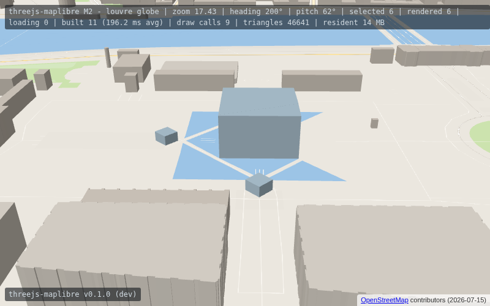
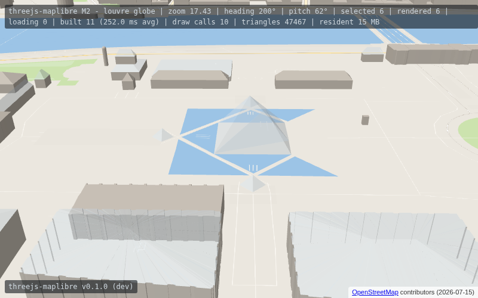

### The straight skeleton

A hipped roof on anything but a rectangle needs the straight skeleton:
shrink the outline inwards at unit speed with every edge parallel to
itself, the corners trace the skeleton, the region each edge sweeps is one
face, and lifting every skeleton vertex by the time it was reached makes
those faces the planes of the roof. F4Map has it ("roofs ridges are
generated using a straight skeleton algorithm"), OSM2World does not (one
ridge from the bounding box, "quasi-rectangular", which is what PR A
shipped), and no JavaScript library was fit to take: the two CGAL
builds are 330 and 500 KB gzipped for one function, the pure ports are
abandoned or hole-less or described by their own authors as unreliable on
real polygons. So `src/build/straightSkeleton.js` is ours: Felkel and
Obdrzalek (1998) the way kendzi's Java port handles it, 1 100 lines with
holes, edge and split events, events at one time and point taken
together, faces closed as they form, and three departures from kendzi
found on real footprints (a vertex's split candidates judged against the
edge's current piece rather than its original wedge; events due at the
time being processed taken rather than dropped; two neighbours left at
one point merged). It never throws: null, and the caller falls back to
the ridge.

Measured: the five real footprints of `test/fixtures/footprints.json`
(the Cour Marly's 179 vertices in 37 ms), 350 seeded random stars and
staircases, 3 000 more in an extra run, all closed, every face set
summing to the footprint's area to float precision; the degenerate
inputs (two vertices, a bow tie, a hole touching the exterior) answered
with null.

On top of it (`appendSkeletonRoof`): hipped and its family lift each
face from the eave by its time, the farthest to the top; mansard and
gambrel cut every face at a third of the way in, steep below the cut
and shallow above it, both parts planar; gabled stands every triangular
face up vertical by moving its apex onto its own wall, which carries the
ridge out to the wall in the faces beside it, so a rectangle gives the
same gable as the ridge method and an L gives one gable per wing end.
A tagged `roof:direction` or `roof:orientation=across` asks for one ridge
where the mapper put it, which a skeleton cannot take, so those keep the
ridge method, as F4Map falls back to its bounding box then. `building=roof`
and `wall=no` draw no walls (the Cour Marly and Cour Puget glass roofs
stand on the wing, not on glass walls to the ground).

Cost on the Louvre budget scene: 0.9% more triangles than the ridge
method. Evidence: the Richelieu wing's courtyard roofs, hipped on 179
and 145 vertices, where the ridge method had drawn them as crooked
pyramids; F4Map's own picture of the same view is at
https://demo.f4map.com/#lat=48.8614&lon=2.3372&zoom=18&camera.theta=58&camera.phi=330
(its Louvre is a hand-made model, so around it the comparison is against
their proprietary database, not their skeleton).

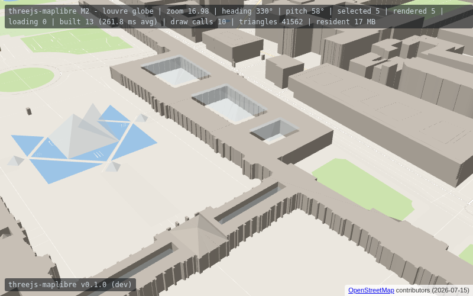

Like for like, where F4Map draws from the same OSM data and not from its
models: the Palais de Justice, its mansards on 13 to 77-sided footprints
in their tagged `roof:colour`, the Sainte-Chapelle's spire, the
Conciergerie's cones. F4Map's view:
https://demo.f4map.com/#lat=48.8560&lon=2.3445&zoom=18&camera.theta=60&camera.phi=20
The shapes match; what F4Map has over this picture is materials, textured
facades and slate, which is M5's concern, not a roof's.

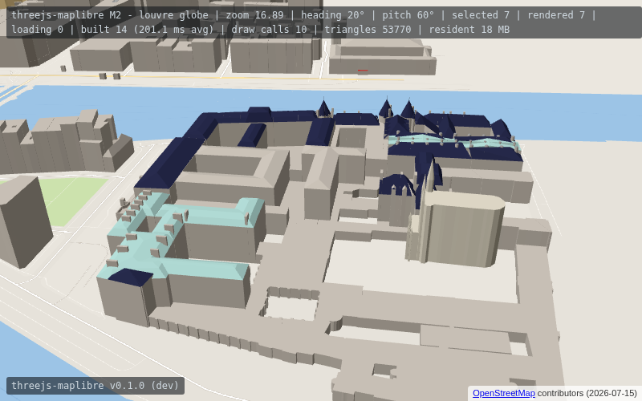
### Indoor: Simple Indoor Tagging as levels

What the kickoff assumed did not hold up to reading the code: neither
map-gl-indoor nor TUM's maplibre-gl-indoor parses OSM's `level=*` (a list
of three is dropped, a range parses as its first number, `repeat_on` is
never read), neither has a router, and the "shared corpus" of level
tagging does not exist. What does exist is two renderers that publish
their level grammar with tests, indoorequal's `level_to_array` (SQL, BSD,
17 cases) and OSM2World's `parseLevels` (Java, MIT), so
`src/indoor/levels.js` is written from both, every case carried over,
decimals accepted where OSM2World rejects them because the Paris
stations use them (`-3.5;-3` at Chatelet-Les Halles).

The data: Gare Saint-Lazare, the richest Paris station in OSM (236
rooms, 98 corridors, 54 areas, 80 `indoor=wall` ways, 254 doors over
levels -7 to 2), extracted by `scripts/osm-extract.mjs --dataset
saint-lazare` into an `indoor` layer with each feature's levels parsed
next to its tags (`levels` as a list, `level_min`, `level_max`).

The geometry: a style's `fill-extrusion` layer over that source layer
with `"threejs-maplibre:indoor": "floor"` or `"wall"` in its metadata
(MapLibre would draw them as extrusions of no height and ignore the
levels). The worker builds a floor as the footprint's slab, 15 cm thick,
at `level * levelHeight` (3 m unless the metadata says otherwise;
OSM2World sizes levels from `indoor=level` outlines' `height=*`, which
the stations do not tag), and a wall as a run along an `indoor=wall` way
or around a room, drawn on both sides, half a meter short of the next
floor so the eye gets over it. A feature on several levels is built once
per level, each into a block of that level, which is the whole trick:
blocks are batches, so `map.setLevel( n )` is a visibility flag per batch
and `map.explode( meters )` a translation per batch, no rebuild. On a
planar map; the globe's up is not world y.

Not here: doors as openings in walls, stairs and lifts between levels,
level heights from `indoor=level`, and the walker (PR D).

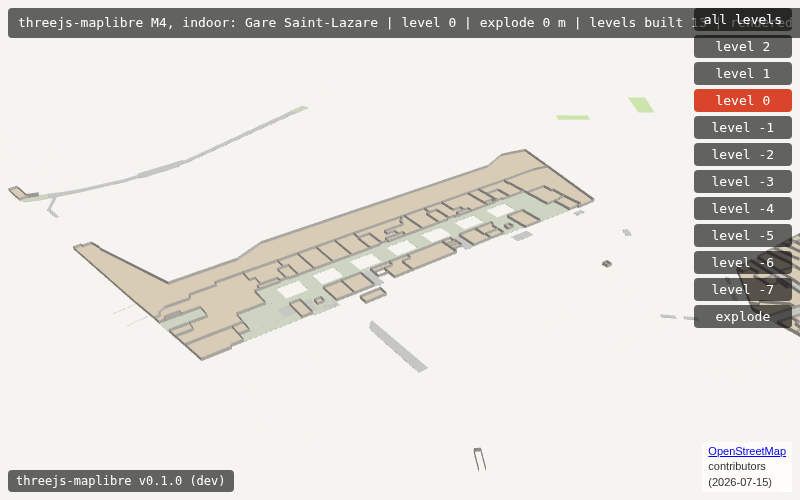
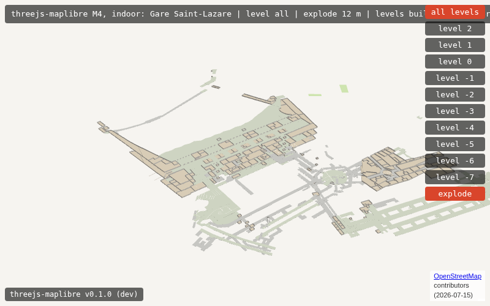

### Doors, stairs, lifts, and a walker

A door is a node on a room's ring (209 of Saint-Lazare's 254 sit on a
vertex, the rest on an edge), so the wall builder cuts the edges it lies
on, 1.2 m wide unless `width` says otherwise, half a door off each edge
meeting at a vertex. A staircase or escalator (`highway=steps` with
levels) is drawn as the slope it climbs, 1.5 m wide from its lowest level
to its highest, down the way when `incline=down`, built into every level
it serves so each level shows its own way up; a lift is a shaft of four
walls over the levels it serves. Both come from the transportation
source layer through the same metadata key.

The route is a graph over the same data (`src/indoor/IndoorGraph.js`,
no three.js): a node per room, corridor or area per level, per door per
level, per staircase end and per lift per level; edges from a door to
the spaces whose ring it lies on or whose polygon contains it, between
open spaces that share a vertex or nest, along a staircase at its length
over walking speed plus 20 s a level (escalators 0.7 of that), up a lift
at 15 s a level; A* with the horizontal time plus the cheapest climb as
its heuristic. On Saint-Lazare: 463 spaces, 320 doors, 178 staircases, 6
lifts, 1 459 edges; Sephora on level -1 to Ladurée on level 0 in 111 s
through one climb, to Paul on level 1 in 242 s through two. What the
data defeats is counted in `graph.stats` and said in the tests: 45 spaces
with no door mapped, 33 doors on no ring, the Passage du Havre across the
street as a component of its own, the Métro 3 platforms 5 m from the
hall's areas. `RouteWalker` walks the route in time, the flat at 1.4 m/s
and the stairs at the route's own pace; the demo draws the route as a
line through the levels (drawn last, since a line with no depth test is
still overdrawn by a nearer floor drawn later), moves a figure along it,
and can follow it with the camera, the shown level following the figure.

Not here: `conveying` direction (edges are undirected), doors as rooms'
only way in (a room sharing a vertex with an open area is open to it),
windows, level heights from `indoor=level`.

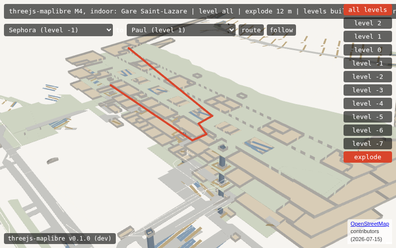
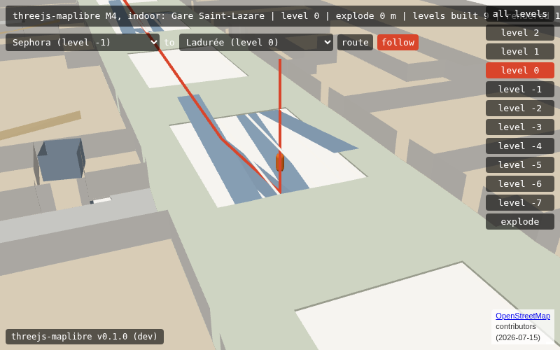

### Where this stands against OSM2World

OSM2World is the rule book the north star names, MIT since 2026, and
every rule here is read in its source and carried with its tests where
it has them. The table is kept current.

| area | OSM2World | here |
|---|---|---|
| heights | 2.5 m a level, `height` wins, `min_height`, `building:min_level` | same; the extract keeps OpenMapTiles' 3.66 m for `building:levels` without `height` |
| roof height | `roof:height`, `roof:angle`, `roof:levels`, else a dome's radius or 5 m | same |
| ridge | `roof:direction` snapped to walls (45, 10, 0.5 degrees), `roof:orientation`, longest side | same |
| roof shapes | 17 values, unknown flat; hipped quasi-rectangular | same values; hipped family on the straight skeleton (F4Map's way); `roof:ridge` and `roof:edge` not yet |
| parts | inherit the outline's tags, heights only when the part has none; outline drawn below 90% coverage | same, the outline minus its parts (F4Map's way) |
| colours and materials | `building:colour`, `roof:colour`, material to colour, glass | colours and glass; no textures |
| `level=*` | integers, lists, ranges; decimals rejected | same, decimals accepted since the data has them |
| indoor | rooms as walls, floor and ceiling; areas; walls; doors and windows on walls; lifts; level heights from `indoor=level` | floors, walls, doors as openings, stairs as ramps (none there), lifts; no ceilings, no windows, levels 3 m |
| routing | none | a graph and A* |
| roads in 3D, trees, power lines, LOD | yes | no, M5 |

## M5 Gamification showcase

### On the streets: a character, solid walls, a camera over the shoulder

What a map renderer cannot do: someone walking the streets, bumping into
the buildings, going down the stairs to the Métro. The pieces, each in
its own module so the engine stays a map engine:

- `src/three/colliders.js`: one bounds tree (three-mesh-bvh, MIT, 62 KB
  gzipped, the one runtime dependency added) per extrusion block of a
  built tile, buildings, roofs, indoor floors, walls, ramps and shafts
  alike, built from the worker's own positions and indices in the block's
  frame when the tile lands (`collision: true` on `VectorTileMap`; the
  arrays stay in memory for it, so it is off by default) and dropped with
  the tile. Two queries: `collideCapsule` pushes a capsule out of every
  triangle it overlaps, the way the library's characterMovement example
  does it (the closest point of the segment to the triangle moves away by
  what is left of the radius, block by block); `groundBelow` casts a ray
  down for the nearest floor or ramp.
- `src/game/CharacterController.js`: a capsule, gravity, a jump, five
  collided steps a frame as in three.js's games_fps; the ground is the
  map's floors and ramps where there are any under the feet, the street
  at 0 elsewhere. Steered by default: left and right turn the character,
  forward walks the way it faces, backward steps back at half speed
  without turning round, so a camera kept behind it always shows where it
  is going (the first version walked sideways on left and right, which
  turned the camera's view to the side of the way the character went).
  `steering: false` keeps the camera-relative walk for a free camera.
  `bounds` keeps it inside the data: past the extract's edge there is
  empty ground, so the edge is a wall nothing gets over, walking, running
  or jumping (`atEdge` says when it is pressed against it). The demo puts
  it 20 m in from the extract's box, where features still run on outside
  it, draws it as a faint red wall and says "edge of the map" when the
  character reaches it. The box is the union of the dataset's queries,
  not the first one's, which was the station's own small box.
- `src/game/Input.js`: keyboard (WASD or arrows, Shift held or R toggled
  to run, space, Q and E),
  the first gamepad (sticks, A, a trigger) and a phone as one input,
  polled a frame at a time as the Gamepad API wants. On a phone the one
  control is a joystick drawn bottom left: the dot pushed up walks,
  sideways turns, out to the red rim runs, its label saying which; a jump
  button bottom right. A touch on the scene does nothing, and there is no
  run button: the first version had a thumb anywhere on the left half as
  an invisible stick and the right half turning the camera, and a thumb
  that missed turned the view instead of walking.
- `demo/walk.html`: the Saint-Lazare neighbourhood with its buildings,
  roofs and all, and the station's interior, every face drawn on both
  sides (`doubleSided: true`) since the camera goes indoors; a CC0 robot
  by Quaternius, the one three.js ships in its examples
  (`demo/assets/robot.glb`, 0.46 MB, licence beside it; KayKit's knight,
  rogue and mage were tried and are 3.6 MB each)
  idling, walking and running by `AnimationMixer.crossFadeTo`; the camera
  behind, dragging or the sticks to turn. The start is the station's
  forecourt entrance; the entrances cut the buildings' ground-floor walls
  (`wallPieces`, shared with the indoor walls), so a street leads into the
  hall and the hall's stairs lead down.

The ground under the map is a plane in the style's background colour,
following the character: a map seen from above gets the land between
mapped polygons (a square, a yard, the space between two pavements) as
its clear colour, but a camera at head height sees the sky colour there,
and the first players read it as water.

Stairwells. OSM maps the floor above a staircase as one area, and the
pavement over a Métro entrance as unbroken street, so a ramp climbed into
the slab and a player went down into the pavement. The tile builder cuts
a hole 2 m wide along every staircase or escalator through each floor it
climbs to (`appendFloorWithHoles`: the floor triangulated as usual, each
triangle with the stairwells' convex quads taken out, a triangle minus a
convex quad being a few convex pieces), and through the street fills
over the ones that go down from level 0 (`appendFillWithHoles`); the
demo's ground plane gets the same holes. The cut is in the geometry, so
the collision follows: a test rides the escalator from the hall and ends
on level 1 at 3.15 m.

Indoor heights are guesses. Floors stand at level times 3 m, which is
right for whole levels and wrong for the split levels a station like
Chatelet-Les Halles maps (-1, -0.75, -0.5, 0): their floors come out
0.75 m apart where they overlap, and the character, 1.7 m tall, hit its
head on the next one up. So indoor geometry is met the way a person meets
it: a floor or a ramp is stood on and never bumped into from below or
from its edge (one-way, as platforms in a game), a wall blocks only on its
own level, within 1.5 m of the feet, and the ground is looked for from
knee height (the 0.5 m a step reaches), not from the head, so a slab at
chest height does not lift the character onto it. Real heights would
need `indoor=level` areas with `height=*`, which neither station tags.

Zoom underground. The map takes its zoom for the style from where the
camera's view meets the ground plane; a camera under the street (in the
Métro mall, at level -1) looking down never meets it, the zoom came out
NaN and every layer with a zoom range hid, the station vanishing round a
player. The distance is now the plane's ahead, or the camera's height over
or under it, and the zoom is held under 24, the spec's default maxzoom,
since a camera at a character's shoulder is closer than any map zoom.

Collision from detail only. A coarser tile is simplified (geojson-vt
here, the tile generator anywhere), so a door can miss its wall line by a
few tens of centimeters and the wall stays uncut; such a tile stays in
memory as a parent behind the detailed ones, and colliding with it closed
doors a player saw open (at one of the station's doors, the zoom 14 tile
alone holds the robot back where zoom 16 lets it through). Bounds trees
are built for the source's most detailed tiles only, which also halves
what collision keeps in memory.

Shared walls. The station is mapped as building parts side by side, and
each part drawn as a closed box put a solid partition wherever two met,
through the street-level mall among other places (5 929 building walls in
the extract stand against a neighbour). A wall now asks which other
extrusions of its layer stand a quarter meter off it, on either side, and
draws only the spans none covers: nothing between two parts of one
height, the upper wall over a lower neighbour. Probing beside the wall
rather than matching edges catches parts that meet where one's corner
sits along the other's wall. Walking from the middle of the mall in eight
directions meets no building wall.

Names. `src/game/Places.js` says where the character is and what is
around it: the space it stands in on its level (from the walking
graph), the named building round it, the nearest named street within
25 m outdoors; and the names within 35 m on its level, the station's
rooms and shops and the named points of interest. The demo shows the
first as a banner ("level -1 · Pylones · Gare Saint-Lazare", "Rue de
Rome") and the second as labels over the places, hidden when a wall
stands between them and the camera (`map.raycast`).

The map's frame is Web Mercator meters, 1.52 a ground meter at Paris;
heights are true meters. Speeds are given in ground meters and scaled,
so the walk is 1.4 m/s and the run 4.2 on the ground. And the character
waits for the tiles under it before gravity starts: a slow load would
drop it through the floor it starts on.

Two things cost an hour each and are worth writing down. A skinned mesh
or a camera millions of meters from the origin (the planar frame is
mercator meters) loses its shape to float32 on the GPU, so everything but
the map's own batches (which have their floating origin already) lives in
a root group moved to the character, 50 m at a time. And `Object3D.lookAt`
takes a world-space point: given the root-local one, the camera looked at
the horizon, the map's zoom read 1.8 off the view centre, and every layer
with a `minzoom` vanished.

The camera stays behind the character, easing round as it turns (9
degrees behind at most while turning on the VM's slow frames, under one
walking straight); a drag looks round until the next step. It is pulled
in to the first wall between the character and where it would be (`map.raycast`, the third query on the colliders), so
it never looks through one.

Measured: 189 tests, among them a capsule pushed out of a hall wall and
clear on the second pass, the hall floor found under a point and nothing
under the street, the controller walking north at 1.6 m/s in the camera's
frame and settling on the hall slab. In headless Chrome, a held W key
walks the character from the forecourt to the entrance wall. On the VM's
software renderer the walk frames at 95 ms with 77 000 triangles in view;
the real-GPU number is PR D's.

Not here: the sky and the hour (PR B), the goal and the start screen
(PR C), props and the budget (PR D), `conveying` direction, a capsule
that climbs a kerb (steps under 20 cm are walked through by the push-out,
higher ones stop it).

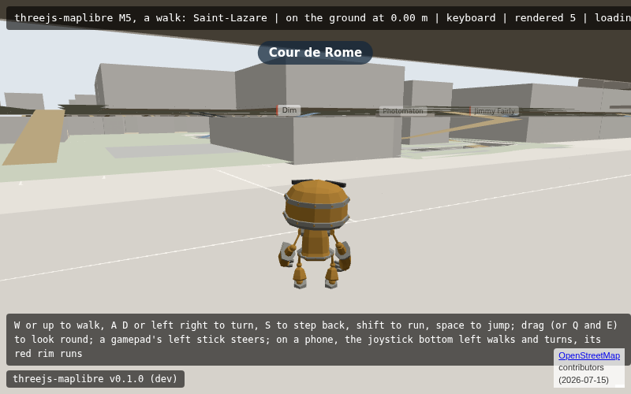
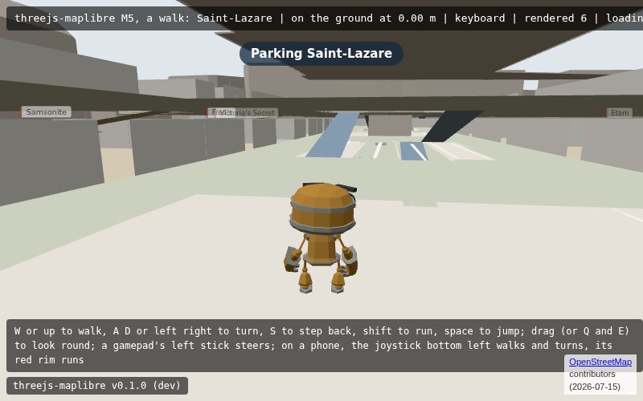
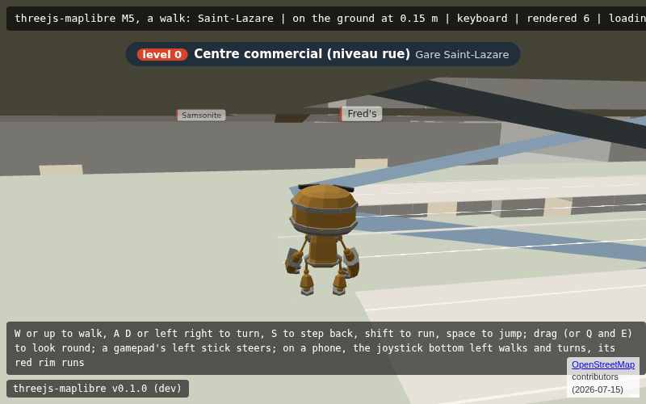
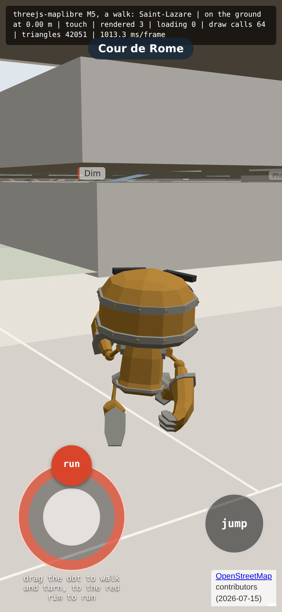
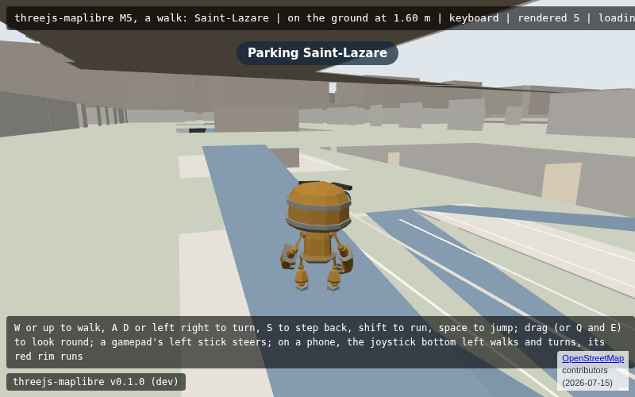
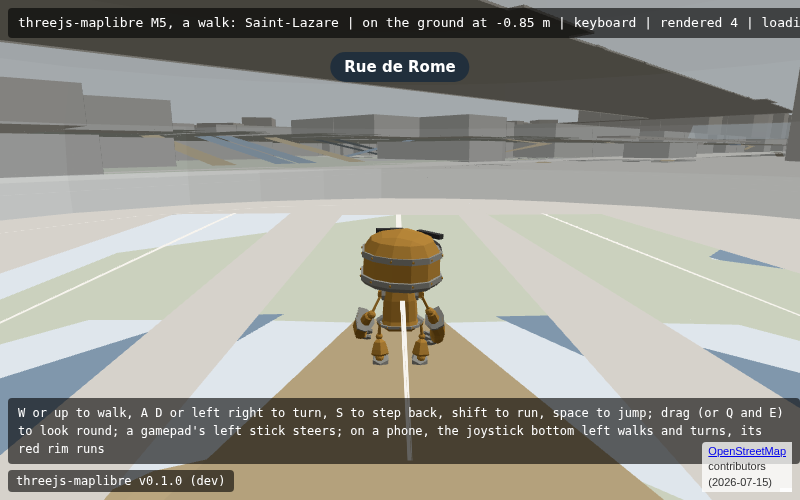
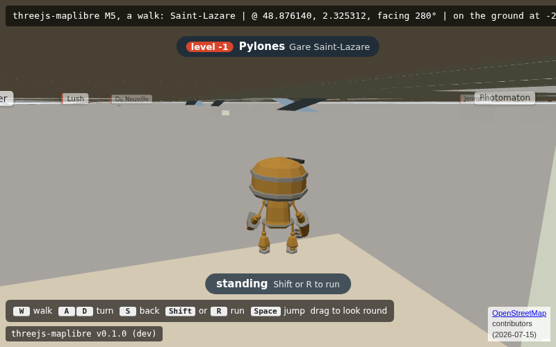
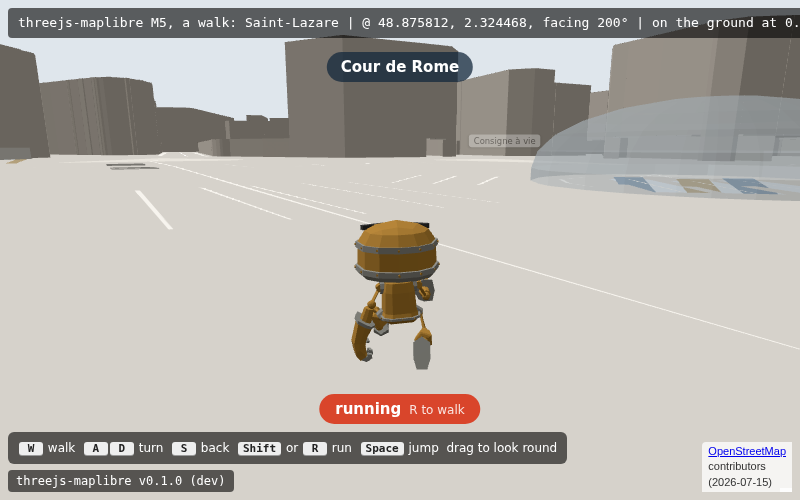

### Falling, and the floor between the rooms

A jump off a balcony now falls to the floor below. The ground is the
highest floor or ramp under the character's knee, however far down. The
street, at 0, counts only for a character at or above it, since
underground it is a ceiling. Before, the ground was searched 2.5 m down
only, and the street stood in for anything further: a jump at level -1
put the character back up at 0.

A fall into nothing is caught. Only a floor under the feet counts as
stood on; touching a wall's edge or a slab's rim on the way down does
not. 40 m below the last floor stood on, the character is put back on it
and `fell` is set. Counting rims as standing made a fall into a void at
Saint-Lazare bounce between 13 and 59 m down.

That void was ours. At level -1 by McDonald's, the strip a jump to the
left lands on is covered by no room or corridor. It lies inside the
outline of the whole level (`indoor=level`, OSM way 320530315), and no
lower level is mapped under it. OSM says it is floor, but the floor
layer drew rooms, corridors and areas only, so it was a hole down to the
sky. The station style now draws level outlines too, as the
`indoor-level` layer, 5 cm under the rooms
(`threejs-maplibre:floor-drop`) so the rooms show on top. Saint-Lazare
maps 11 level outlines, from level 2 down to the RER platforms at -7;
Châtelet maps one, at -3. Stairwell holes are cut through them like any
floor.

A second hand-play report fell for ever at level -4 (48.875704,
2.326286), 12 m under the street. The floor was mapped and built, but the
tile tree never chose its tile. A tile's box stood on the street and
reached `contentHeight` up, never down, so a camera underground was
outside every box: the fine tiles around it were culled or taken as far,
and a zoom 15 ancestor was drawn in their place. Colliders are built for
the source's deepest zoom only, so under the robot nothing was solid; put
back where it stood, it fell again. Tile boxes now reach `contentDepth`
under the street, 60 m for a planar vector map, which is under the RER
platforms at Saint-Lazare (level -7, 21 m down). The globe keeps 0: a
deeper box there widened a straight-down view's selection from 4 tiles to
9, and nothing walks under a globe yet. In headless Chrome at the
reported spot, the robot now stands on level -4, and dropped under that
floor it is caught once and stays.

And whatever else takes a floor away, a fall from where the character
was put back, before it stood anywhere, sends it to the start of the
walk instead of round again.

### A ledge, a ceiling, and the earth

The same spot, once its tile was solid, gave three more reports in one
screenshot: the robot stood a meter under the level -4 floor with its
legs hidden, the corridor ended in nothing, and everything around was
sky blue.

The sunk robot: the two level -4 corridors there are two OSM polygons
that do not touch, with a gap of 4 m between them that no level outline
covers either. Running into the gap, the robot fell, and on the way down
its head went up through the slab of the floor it had left. A floor is
one-way (it pushes up only), and the slab's top face, found above the
capsule's upper end, pushed it up by a hair and counted as ground. The
robot hung from the ceiling, held by its head, "on the ground" at
-12.85 m. A floor now holds the character only where it meets the feet,
up to `FLOOR_REACH` (0.7 m) above them; met higher, it is a ceiling.

The gap itself is the data's, and nothing drawn in it says there is a
drop. So a walk stops at a ledge: a step whose landing has no ground
within `ledge` (1 m) below the feet is not taken, the character stays
at the edge with `atLedge` set, and the page says "a drop: jump to go
down". A jump goes over, and falls to whatever is below, or into the
void and back. Outdoors the street is always there, so the rule never
fires on it; it does on a roof.

The ledge rule's first version probed the ground under the centre of
the feet, and stopped the robot on the Métro stairs: three OSM ways run
side by side there, each built 1.5 m wide, with a slot between two of
them that the robot stood astride, its soles on both and nothing under
its centre. The ground is now the highest floor under any of five soles
(the centre and four points at the capsule's edge), for the ledge rule
and for standing alike, so a character with its centre just past a
floor's edge still stands on it, as its capsule's radius says.

The sky: the page's backdrop and the fog were the sky's colour, and
underground, where OSM maps nothing, that is what showed through. Over
the first 3 m of the camera's descent the walk page now blends both to
an earth brown and closes the haze from 900 m to 160 m.

Measured: 210 tests, among them a walk stopped at a ledge and a jump
taken over it to a floor 6 m down, a walk along a slot between two
floors, a run up the Métro stairs from level -4, a character with its head through a
slab from below falling on, the street kept outdoors, a void caught, a
floor gone from under the place the character was put back, the
reported jump at Saint-Lazare landing 5 cm down on the level outline,
and the deepest tile picked under a camera below the street (and not,
with `contentDepth: 0`). In headless Chrome from the level -4 spot, five
headings at a run never leave the floor; with a jump every 3 s, two
headings fall into the gap and come back.

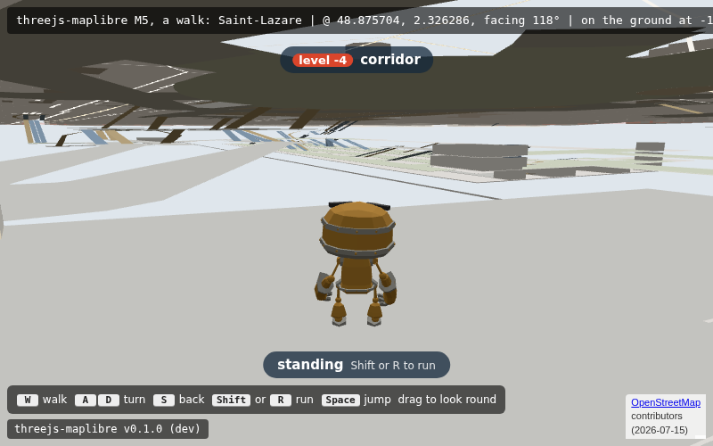
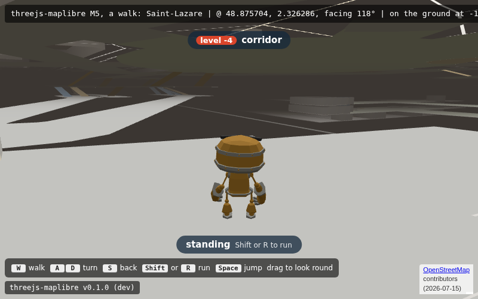

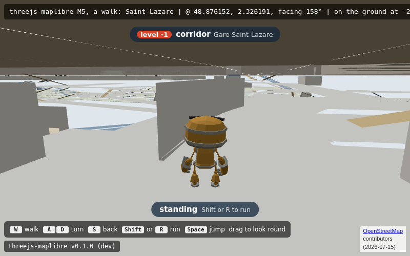
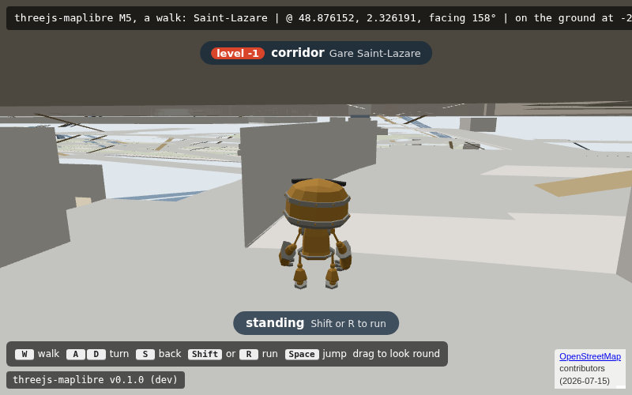

### The game: a goal, a clock, the way there

The walk is now something to finish. A start screen names the place and
the goal, a platform deep under the station: at Saint-Lazare the Métro
13 platform towards Châtillon-Montrouge, four levels down; at
Châtelet-Les Halles RER platform 1, five levels down. The streets load
behind the screen and Start comes on when they have landed, so the
first step is on solid ground. From then a clock runs and a box keeps
the goal in view: its name, its level, the distance as the crow flies,
the levels still to go down. Standing in the goal's space on its level
ends the walk with the time, and a button to walk again.

The way there is drawn on request (H, or the button): M4's indoor graph
routed with A* from where the character stands, through the entrance,
the hall, the stairs, to the platform, as a line 40 cm over the floors
in the floating-origin root. At Saint-Lazare the graph says 4 min 16 s
on foot, through levels 0, -1 and -2 to -4; the line is the proof that
the route the walker takes and the floors the character walks are the
same data.

Châtelet's start moved to the Porte Lescot. The entrance nearest the
old start is the Lego store's own door, and its room joins no corridor
in the data: the station's walking graph there has 110 components, and
the Lego store is in one of 13 nodes. Porte Lescot joins the big one
(645 nodes, levels -5 to 0), and from 8 m outside it the graph routes to
platform 1 in 206 s.

Measured: 220 tests, among them the route from each place's start to
its goal and the goal's space found under its centre, a staircase cut
into the street walked down and walked over where the street is whole,
on a railed ramp a step and a jump across stopped by the rail while the
walk along it goes down, the shops labelled round the Porte Lescot, a
ring moved inward and a door cutting an edge from just past its end,
the lift by the Métro 13 corridor with its five levels, a shaft's
doorway built with its jambs and lintels, and a walk into the car
through it and not through its walls. In headless Chrome at
Saint-Lazare: from the lift room on level 1 the panel shows dimmed,
the walk to the car ends inside it and the panel lights, the ride to
level -3 sets the robot down at -8.85 m in the hall of level -3, and it
walks back out to where it stood.

Playing it, the first thing found was that the stairs down from the
street could not be taken: at the top of the Métro escalators the robot
stood on the street and the ramp a meter under it was never the ground.
The street at 0 counted everywhere for a character at or above it,
over the stairwell holes included, since the controller knew nothing of
the holes. It now takes a `street( x, z )` predicate, and the walk page
gives it the stairwell quads it cuts the ground mesh with: over a hole
there is no street, the ground is the ramp below, and a jump over a
hole falls onto it.

The second thing: on an escalator the robot could step or jump off
the side. Real stairs and escalators have balustrades, and ours had a
ramp and nothing else. Every ramp now gets a rail up each edge
(`appendRail`), a thin wall 1.1 m high (`RAIL_HEIGHT`, more than the
0.8 m a jump reaches at the walk's gravity), drawn as the balustrade and
built into a block of its own with `indoor: 'rail'`: the ramp holds the
character from above only, the rail is solid from every side at any
height, as a wall is only on its own level. The rails fence the
stairwell cut in the floor above as well.

The third: from the top of the escalators on level 1 a jump still got
down. The stairwell cut in a floor was 2 m wide over a 1.5 m ramp, so
a 25 cm strip of hole ran beside each rail, and where two escalators
run side by side the strips added up to a meter of nothing between the
rails: a running jump north-east from the landing fell through to
level 0. The hole is now 10 cm wider than the stairs (`STAIRWELL_WIDTH`
over `STAIR_WIDTH`, in the walk page's ground too), so the rails stand
at the hole's edge and the floor between two escalators is floor.

Walking the rue Pierre Lescot at Châtelet, the street was unlabelled
where OSM shows a shop every ten meters: the extract took points of
interest from tourism and amenity nodes only, and a shop is a shop
node. The street queries now ask for `node["shop"]` too, and the
extract files them as points of interest of class `shop` with the kind
of shop in `subclass`, which Places already labelled as shops. The
label of a point sits a few meters inside its shop front, behind the
building's wall from the street, so a point's label now shows through
one wall within 6 m of it, where a named space still hides behind any
wall before it. The labels now reach 60 m and twenty of them, from 35
and twelve: a street is wide and the shop fronts stand back from where
one walks, and in a mall the walls hide what is not in the room. (The
Forum's forecourt is an indoor area in OSM, so indoors was no test to
switch on.) Both extracts were taken again from Overpass for this.

On the rue Pierre Lescot the Forum's facade flickered as the camera
moved: z-fighting, two walls on one plane. OSM mappers share a room's
nodes with the building's outline (Aroma-Zone's wall is the building's
line there) and with the next room's, so the indoor wall and the facade
were drawn on the same plane. A room's walls are now built on its ring
moved 5 cm inward (`insetRing`, mitred, the mitre capped at a sharp
corner): off the facade, and 10 cm from the next room's wall on a
shared line. The depth buffer tells 5 cm apart at 30 m with room to
spare. The inset moved a corner a few centimeters along its edges, past
the door the mapper had put on the corner, and the Lego store's
entrance closed: a door now cuts an edge from up to its half width past
either end.

The lifts ride. A lift was a shaft of four walls and a room with a
door, and standing in one there was nowhere to go. The walk page takes
the graph's lift stops (one per level per elevator node), and within
2.5 m of one, on a level it serves, shows a panel with the lift's
levels, the current one marked, as the panel in a lift does; PageUp and
PageDown take the next level. The ride carries the character straight
up or down where it stands, eased, 1.2 s a level, the controller held
still meanwhile, and sets it down on the floor of the level chosen,
which the lift room has on every level it is on.

Then the shaft got its doorway, since a lift one rides from outside
the car is no lift. OSM maps the elevator as a point, so the car's
2 m square and its door are the engine's to place: the doorway, 1.1 m
wide and 2.2 m high at every level served, faces the middle of the room
the point stands in (its space, as a rule a room tagged elevator), or
north when it stands in none; two jambs run the shaft's height and a
lintel closes the door from its top to the next level's floor. The
panel shows within 2.5 m, dimmed with "step into the car", and the
levels can be picked from inside the car, within 0.9 m of the point.

The recorded walk: the robot driven along the route in headless Chrome
(a frame every 3 s of walk time, the way shown), from the forecourt to
the platform in 3 min 7 s.

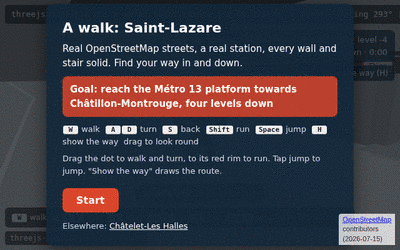
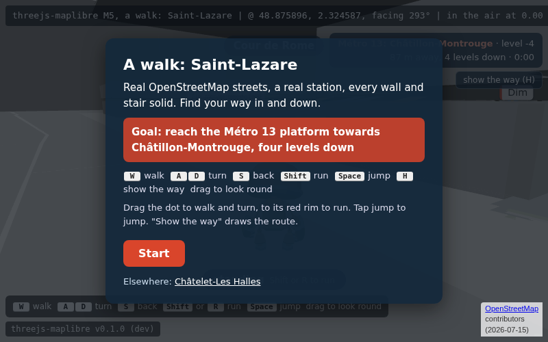
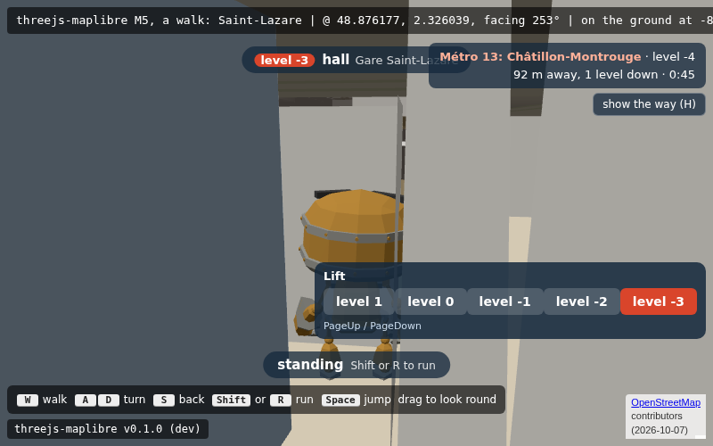
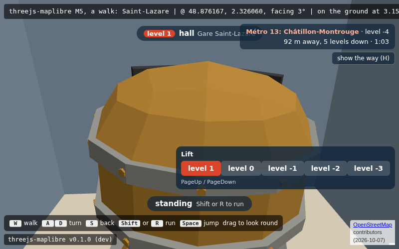
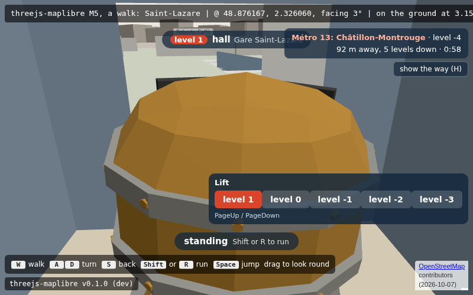
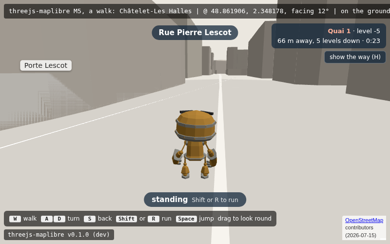
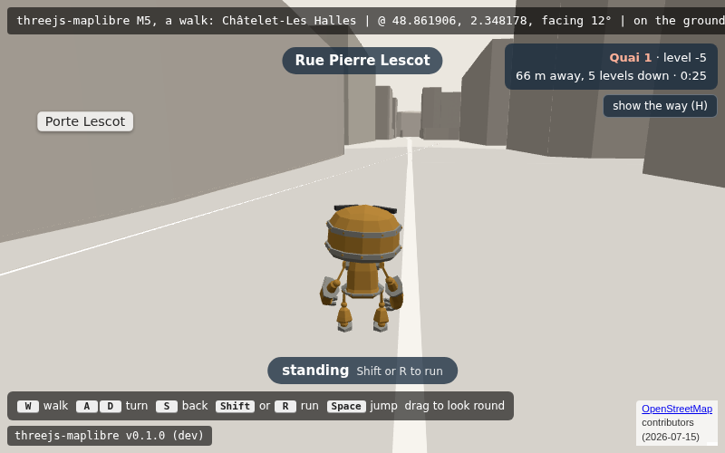
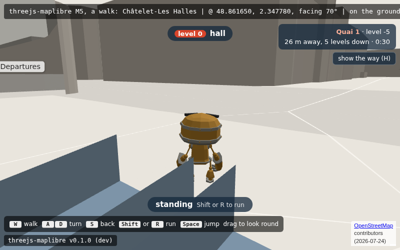
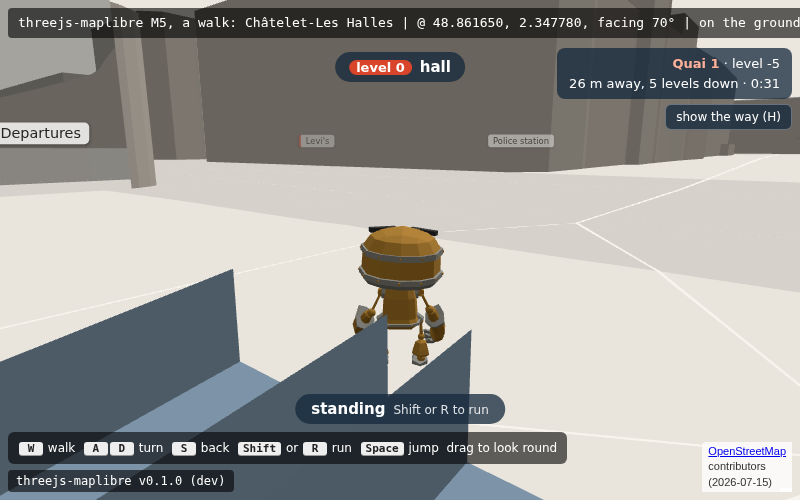
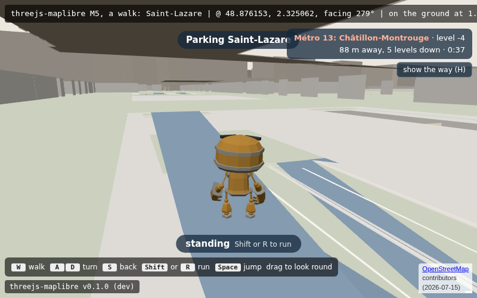
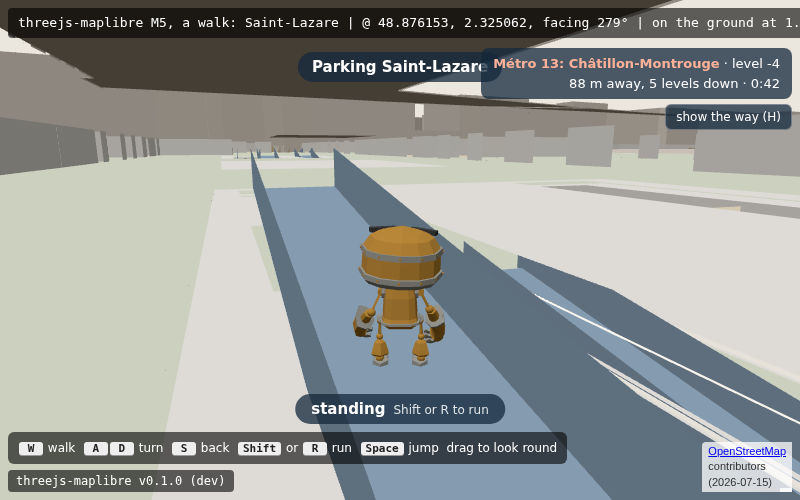
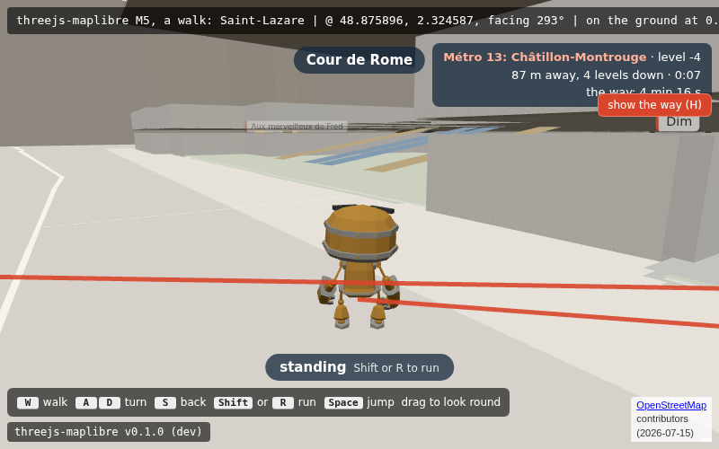
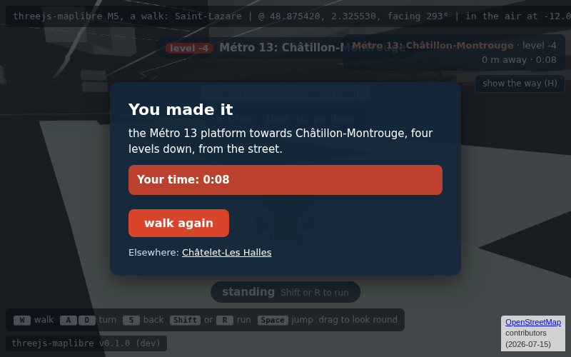

### Into the bubble, steps on the stairs, escalators that carry

Three more hand-play reports on the public demo, the day it went out.

The glass bubble over the Cour de Rome escalators (the Lentille,
building 64046222: `building:material=glass`, `roof:shape=dome`, 6 m)
was drawn right, translucent, and could not be entered: OSM has two
footways running into it and no entrance node on its outline. A path at
street level that crosses a building's outline now cuts an opening 2 m
wide where it does, as a mapped entrance does; the glass shell has its
two ways in, and the walk down to the Métro begins where the footways
say.

Stairs are steps. A staircase was a smooth ramp, which reads as a slide;
`appendSteps` builds it as risers 17 cm high (`STEP_RISER`) and the
treads between, along the way from its lower end to its upper, both
faces of each. The character climbs them as kerbs, under its step
height, and walks down them as small drops, under the ledge; the rails
and the stairwell are as before. A long flight is a few hundred
triangles; the budget is measured on the Louvre, which has none.

Escalators move. A staircase with `conveying=*` keeps the smooth ramp,
and the built tile now carries its runs (`built.escalators`: the way's
points with their heights in the tile's frame, a half width, a
direction: 1 along the way for `forward`, -1 for `backward`, 0 for
`reversible`, whichever way the rider faces). `conveyorAt` finds the run
under a point, within its half width and 1.5 m of its height, and gives
the belt's direction; the controller adds the belt's pace (0.5 m/s, an
escalator's) to its velocity while standing on one, walking on it adds
to that. Standing still the gait reads "on the escalator".

Measured: 224 tests, among them the walk into the bubble from the rue
de Rome, steps built with 17 cm risers over 3 m (18 of them, 19
heights and nothing between) and climbed and walked down, the
station's escalators recorded with their directions, the belt found
under a point and not beside or over it, and a standing character
carried 2 m in 4 s. In headless Chrome on the Cour de Rome escalator,
standing still for 8 s: carried 4.2 m and 0.9 m up to the level 1
landing, the gait reading "on the escalator" on the way and "standing"
at the top.

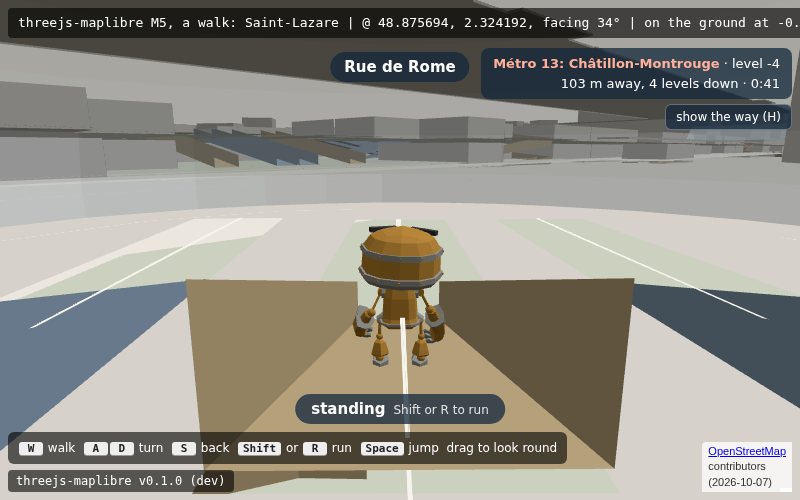
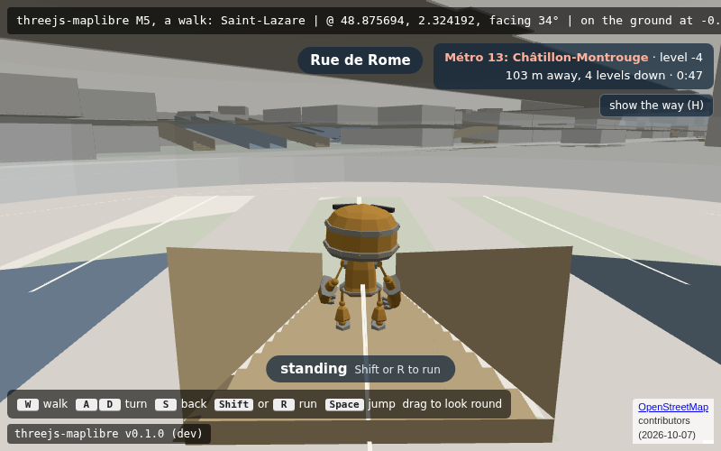
